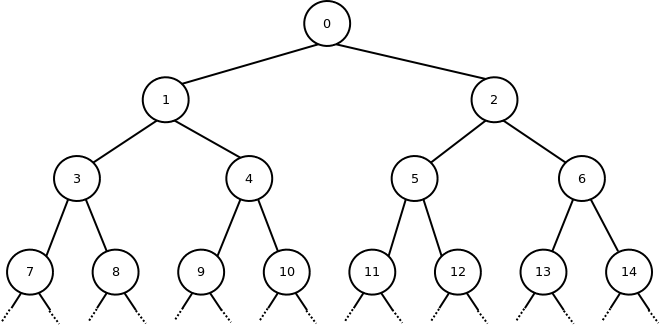

## 문제

The English language abounds with terms for describing family (genetic) relationships. The basic relationships are:

* Self, parent (mother and father), and child (daughter and son) are well understood.
* Another child of your parent is your sister (if female) or brother (if male).
* The child of your sister or brother is your niece (if female) or nephew (if male). You would be their aunt (if female) or uncle (if male).
* Two people who share a common grandparent but not a common parent are 1st cousins. If they share a common great-grandparent but not a common grandparent, they are 2nd cousins. This can be extended to 3rd cousins and so on.

These relationships are extended to later generations as follows:

* The daughter, son, niece, and nephew relationships can be extended to later generations by pre-pending "grand", "great-grand", or "great-great-grand". Thus the son of one's son or daughter is a grandson. The son of your niece or nephew is your grandnephew. Your grandnephew's daughter would be your great-grandniece, and so on. (In theory, we could extend this to any number of additional "great-" prefixes, but we will stop with "great-great-grand" in this problem.)
* The mother, father, aunt, and uncle relationships are extended symmetrically by the same prefix. Thus you would be the grandmother or grandfather of your granddaughter or grandson, the great-granduncle or great-grandaunt of your great-grandnieces and great-grandnephews, etc.
* The cousin relationship is extended to your cousin's descendants by degrees of removal. The children of your 1st cousin are your 1st cousins once removed (and, symmetrically, you are their 1st cousin once removed). The grand-children of your 3rd cousin are your 3rd cousins twice removed. The great-grandchildren of your 2nd cousin are your 2nd cousins thrice removed. All of the cousin-based relationships are symmetric, so if someone is your Kth cousin something removed, you are theirs as well.

Write a program to determine the relationship of one person to another.

## 입력

Input will consist of one or more datasets. Each dataset consists of a single line containing two integers A and B (0 <= A, B <= 32767) and a character. A negative number for the first integer indicates end of input.

The integers identify persons A and B. The character will be either M or F, designating the gender of person B as male or female.

The integers identify the positions of person A and person B in a family tree envisioned as follows: consider a full binary tree in which the root is numbered 0, its children are numbered 1 and 2, the children of 1 are 3 and 4, the children of 2 are 5 and 6, and numbering proceeds in that manner, level by level, left to right. This numbering scheme is shown in the diagram below. A parent-child relationship in this tree represents a parent-child relationship in the family.

## 출력

For each dataset, print a single line indicating the relationship of B to A. This relationship must be constructed from the phrases "self", "sister", "brother", "daughter", "son", "mother", "father", "niece", "nephew", "aunt", "uncle", "cousin", "grand", "great-", "1st", "2nd", "3rd", "once removed", "twice removed", and "thrice removed". No more than two "great-" prefixes may be applied. If "1st", "2nd", or "3rd" is used, it should be separated from the following part of the line by a single blank. If "once removed", "twice removed", or "thrice removed" is used, it must be separated from the preceding part of the line by a single blank. If it is not possible to describe the relationship of B to A under the above limitations, then print "kin".
