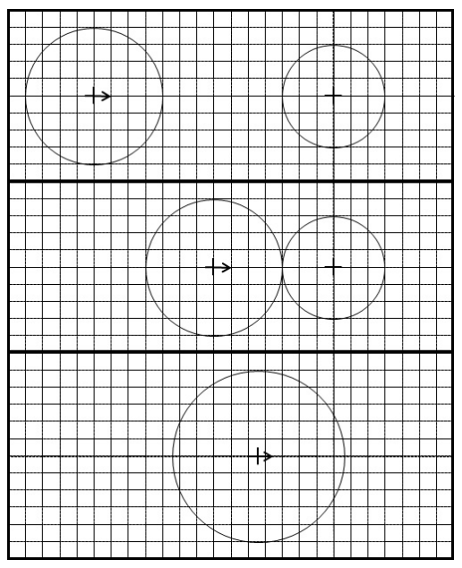

## 문제

In this problem, we are simulating the dynamics of moving objects. The objects are droplets that are modeled in two dimensions as circles of various sizes, each moving at a constant velocity. When two circles touch they combine (i.e., agglomerate) into a single circular droplet with an area equal to the sum of the areas of the two combining droplets. The newly formed droplet’s position is the area-weighted average position of the two droplets at the time of contact and its velocity is the area-weighted average velocity of the two circles. (See the following example.)

The figure to the right illustrates the process of agglomeration. In the top panel of that figure, we see the leftmost droplet with radius 4 centered at position (−14, 0) and with velocity (1, 0) moving toward a stationary droplet of radius 3 centered at the origin. The two droplets make contact at time t = 7.0 as shown in the middle panel of the figure.

The droplet with radius 4 is centered at (−7, 0) at the time that the two droplets agglomerate into a single new droplet. The two original droplets have areas 16π and 9π, respectively, and thus the new droplet has area 25π and thus radius 5. The x-coordinate of the aggolomerated droplet is equal to 16/25 · (−7.0) + 9/25 · 0.0 = −4.48. The y-coordinate is 16/25 · 0.0 + 9/25 · 0.0 = 0.0. By similar calculations, the velocity of the aggolomeration is (0.64, 0).

Given an initial configuration of droplets, your goal is to simulate their motion until reaching the final time at which an agglomeration occurs (if any). All test sets have been crafted to assure that:

* The original droplets do not touch each other.
* When a new droplet is formed from an agglomeration, the new droplet will not immediately be touching any other droplets. (In fact, it will be at least 0.001 away from any other droplets.)
* No two droplets will ever pass each other with only a single point of intersection. (In fact, changing the radius of any drop by ±0.001 will not effect whether it collides with another.)
* No two pairs of droplets will ever collide at precisely the same time. (In fact, all agglomerations will be separated in time by at least 0.001.)
* No agglomerations will occur beyond time t = 109

## 입력

The input consists of a description of the original configuration. The first line contains the original number of droplets, 2 ≤ N ≤ 100. This is followed by N lines of data, each containing five integers, x, y, vx, vy, r, respectively specifying the x-coordinate of the center, the y-coordinate of the center, the x-component of the velocity, the y-component of the velocity, and the radius. These quantities are bounded such that −10 000 ≤ x, y, vx, vy ≤ 10 000 and 1 ≤ r ≤ 100.

## 출력

Output a single line with two values k and t, where k is the number of droplets in the final configuration and t is the time at which the final agglomeration occurred. If a data set results in no agglomerations, k will be the original number of droplets and 0 should be reported as the time. The value of time should be reported to have an absolute or relative error of no more than 10−3.
