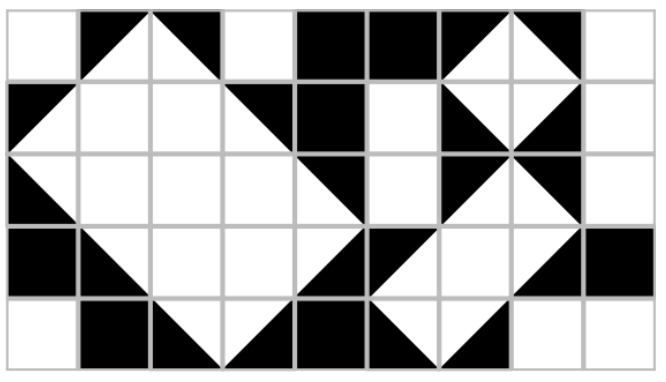
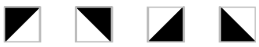
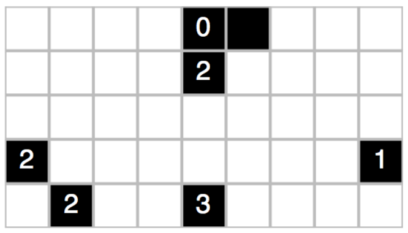

## 문제

In this problem, we consider a special class of tile mosaics, as exemplified in Figure G.1. Each such mosaic is built on a rectangular grid with a white background. Within each cell of the grid is either a square black tile, a triangular black tile in one of the four orientations shown in Figure G.2, or nothing, in which case the grid cell remains white. Furthermore, each mosaic is designed so that any shape that remains white is rectangular (possibly rotated).1

Figure G.1: An example of a mosaic

Figure G.2: Orientations for triangular tiles

To install such a mosaic, an artist starts by placing all the black squares. Remaining black triangles will later be added by assistants in order to complete the pattern. To ensure that the assistants complete the mosaic as envisioned, the artist marks some of the black tiles with a numeric label that indicates the number of black triangles that share an edge with that square. (Black tiles without a label may have any number of neighboring triangles.) The artists provides enough labels to ensure a unique design.

For example, Figure G.3 shows a starting configuration that uniquely defines the mosaic shown in Figure G.1. Given such a starting configuration, you are to determine the number of triangles needed to complete the mosaic.

Figure G.3: A starting configuration that uniquely defines the mosaic from Figure G.1

1Our inspiration for such mosaics is www.nikoli.com/en/puzzles/shakashaka.

## 입력

The input consists of a single test case. The first line contains two integers, 1 ≤ W ≤ 24 and 1 ≤ H ≤ 18, that designate the width and height of the mosaic, respectively. Following that are H additional lines, each with W characters. The characters 0, 1, 2, 3, and 4 designate black squares with the indicated constraint on the number of neighboring triangles, and the character ’\*’ designates a black square without such a constraint. All remaining locations will be designated with a ’.’ character and must either be left empty or covered with a single black triangle. Inputs have been chosen so that they define a valid and unique mosaic.

## 출력

Display the number of triangles used in the mosaic.
