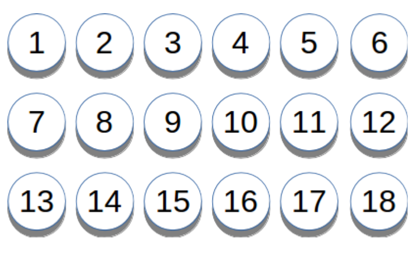
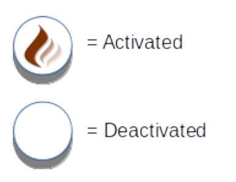
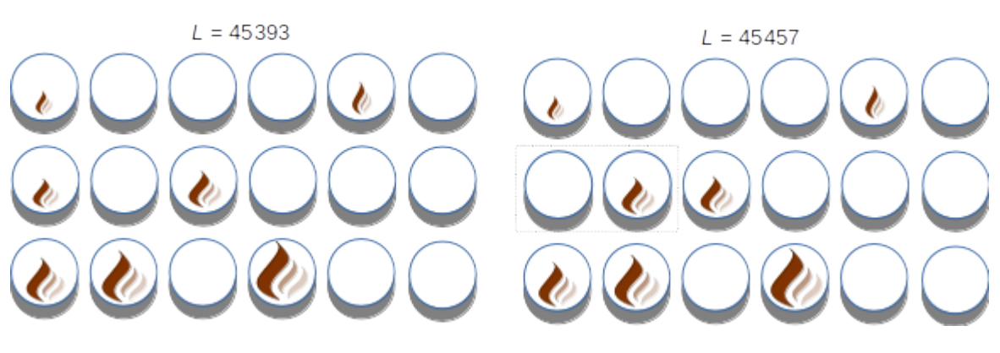
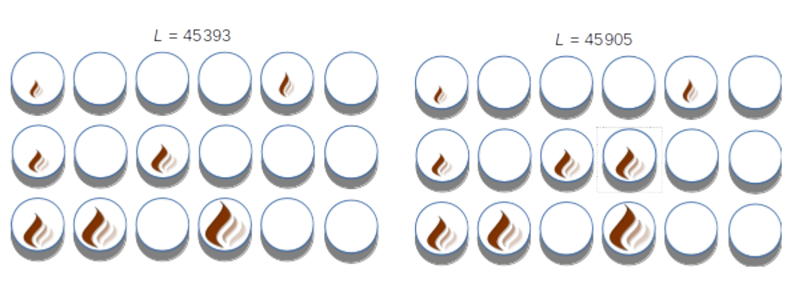

## 문제

The Impressively Calculable Pyrotechnics Company has been contracted to provide certain stage effects for a rock festival. In particular, fire is requested (because fire makes the crowd go wild). In order to pull this off, the main stage is outfitted with a series of tubes, each specially calibrated to deliver a flame burst of a particular luminosity. In all, there are 18 numbered tubes arranged on the stage as follows:

Figure H.1: Pyro tube numbering

Tube 1, when fired, produces a luminosity of 1. More generally, the luminosity produced by Tube N (when N > 1) is double the luminosity produced by Tube N − 1.

To achieve a specific luminosity, multiple tubes can be activated to fire simultaneously. The luminosity achieved is the sum of the individual luminosities of the activated tubes when fired. The total luminosity is represented by a single integer L. The software used to control the system accepts the value of L as an input argument, and determines which tubes need to be activated to achieve that luminosity (and which remain deactivated).

Figure H.2: Pyro tube states

The design of the system ensures that a given L-value can be achieved by firing a unique set of activated tubes. While the system under normal conditions can precisely generate the expected luminosity, it will occasionally encounter technical problems (sticky valves, clogged tubes, etc.) that temporarily prevent it from firing a particular requested set of tubes, so it can activate and deactivate tubes to fire a different set.

Figure H.3 shows two groups of tubes that have two differences: Tube 7 is activated on the left and deactivated on the right, while Tube 8 is deactivated on the left and activated on the right.

Figure H.3: Pyro tube states for requested luminosity (left) and 2 state changes (right)

Figure H.4 illustrates tube states for a requested L-value of 45 393 on the left, while Tube 10 is activated in the group on the right to produce an L-value of 45 905:

Figure H.4: Pyro tube states for requested luminosity (left) and 1 state change (right)

During the course of designing the stage effects, the producers of the rock festival have been made aware of possible technical issues that require the state of the tubes to be changed, resulting in an L-value that is different than what was originally planned. This will be OK, as long as the tube states can be quickly adjusted, and is brighter than the original L-value. Because they are obsessed with micromanagement, the producers will provide a list of L-values they have scheduled for the show, and they request a report be generated that provides, for each original value given, the count of all alternative L-values that meet the following 3 requirements:

1. The alternate L-value must be greater than the original L-value.
2. The alternate L-value must be another value in the given list.
3. The alternate L-value must be achieved by changing no more than 2 tube states from the original.

## 입력

The requested L-values will be indicated, one per line in increasing order, such that 1 ≤ L ≤ 250 000 for each L-value (and thus with at most 250 000 such values). A single −1 will appear on the last line to signify the end of input.

## 출력

For each original L-value, in the order given, output a line of the form L:C where integer L is the original requested luminosity value, and integer C is the quantity of alternative values meeting the 3 requirements given above.

Note: some strategies may produce correct results, but will not finish in the allotted time; a time-efficient solution is critical.
