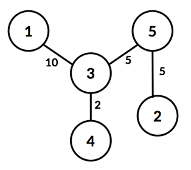

## 문제

다익스트라 알고리즘(Dijkstra algorithm)은 어떤 변(edge)도 음수 가중치를 갖지 않는 그래프에서 주어진 출발점과 도착점 사이의 최단 경로 문제를 푸는 알고리즘이다. 다시 말해서 임의의 그래프에서 꼭짓점들이 각각 교차로를 나타내고, 변들을 교차로 사이를 연결 하는 도로의 길이를 나타낸다면, 다익스트라 알고리즘을 이용하여 두 교차로의 최단 경로를 구할 수 있다.

그러나 실생활에서는 각 교차로에 신호등이 있기 때문에, 교차로를 항상 지날 수 있는 것은 아니다. 그래서 최단거리가 아닌 다른 곳으로 우회하는 것이 목적지까지 더 빠르게 갈 수 있는 경우도 있다.

신호등은 주기 P초 단위마다 신호가 바뀐다. 어떤 교차로 i에 연결된 교차로들의 번호를 x1, x2, ..., xn (x1 < x2 < ... < xn)이라 했을 때, 처음 P초간은 x1에서 온 차들만 i를 거쳐 x2, ..., xn으로 갈 수 있고, 그 다음 P초간은 x2 에서 온 차들만 i를 거쳐 x1, x3, ..., xn으로 갈 수 있다. 이런 식으로 P초마다 교차로 번호 오름차순으로 교차로 i를 이용하여 다른 교차로로 통행할 수 있으며, n×P초가 지나면 다시 x1부터 P초간 교차로 i를 이용할 수 있게 된다.

|  |  |  |
| --- | --- | --- |
|  |  |  |
| (a) | (b) | (c) |

예를 들어 현재 교차로 번호가 3번이고 3번과 연결된 교차로 번호가 1번, 4번, 5번 교차로 일 때 0초 이상 P초 미만까지는 위 그림 (a)와 같이 1번 교차로와 연결 된 도로를 이용하여 3번 교차로에 도착한 차들이 다른 교차로로 가는 도로를 이용할 수 있다. P초 이상 2×P초 미만까지는 그림 (b)와 같이 4번 교차로와 연결된 도로를 이용하여 3번 교차로에 도착한 차들이 다른 교차로로 가는 도로를 이용할 수 있다. 마찬가지로 2×P초 이상 3×P초 미만까지는 그림 (c)와 같이 5번 교차로와 연결된 도로를 이용하여 3번 교차로에 도착한 차들이 1번이나 4번 교차로로 갈 수 있다. 그 다음 3×P초 이상 4×P초 미만동안은 다시 (a)와 같은 상태가 된다.

다음과 같은 조건 하에서 자동차가 출발지에서 목적지 까지 가는 최소 시간을 알아보자.

* 자동차는 1초에 1의 길이만큼 이동한다.
* 자동차는 하나의 교차로에서 출발하고 목적지 역시 교차로이다.
* 교차로의 모든 신호등은 자동차의 출발과 동시에 동작하기 시작한다고 가정한다.
* 출발 교차로와 도착 교차로에서는 신호를 기다릴 필요가 없다.
* 어떤 교차로에서 같은 교차로로 돌아오는 길(self loop)은 없다.

예를 들어, 위와 같은 도로에서 시작 교차로가 1번이고, 4번 교차로가 목적지라고 하자. 그러면 1번 교차로에서 출발한 차는 10초에 3번 교차로에 도착한다.

이때, 3번 교차로의 주기가 2초라면, 10초 이상부터 12초 미만까지는 5번 교차로에서 온 차들만 도로를 이용할 수 있으므로, 1번 교차로에서 온 차가 4번 교차로로 가기 위해서는 12초까지 대기해야 한다. 따라서 1번 교차로에서 4번 교차로까지 가는 데는 14초가 걸린다.

모든 도로의 길이와 각 신호등의 주기가 주어졌을 때 출발 교차로에서 목적 교차로까지 가는 최소 시간을 구해보자.

## 입력

첫 번째 줄에 테스트케이스의 개수 T (1 ≤ T ≤ 10)가 입력으로 주어진다. 이어서 각 테스트 케이스마다 첫 번째 줄에는 교차로의 수 N (1 ≤ N ≤ 105), 도로의 수 M (0 ≤ M ≤ 105), 출발 교차로의 번호 S (1 ≤ S ≤ N), 도착 교차로의 번호 D (1 ≤ D ≤ N)가 주어진다.

두 번째 줄부터 연속한 M개의 줄에 a, b, c (1 ≤ a, b ≤ N, a ≠ b, 1 ≤ c ≤ 105)가 입력으로 주어지는 데 a번 교차로와 와 b번 교차로 사이에 길이가 c인 양방향 도로가 있음을 의미한다.

그 다음 줄에 각 교차로의 신호등의 주기 Pi (1 ≤ i ≤ n, 1 ≤ Pi ≤ 100)가 공백 하나를 사이에 두고 주어진다.

모든 두 교차로 사이에는 최대 한 개의 도로가 존재할 수 있다.

## 출력

각 테스트케이스마다 출발 교차로에서 도착 교차로까지 자동차를 이용하여 가는데 걸리는 최소 시간을 출력하여라. 출력의 결과가 int 범위를 넘을 수 있으므로 64bit 변수를 이용하여 출력하는 것을 권장한다. 만약 두 교차로로 갈 수 있는 경로가 없을 경우 -1을 출력하라.
