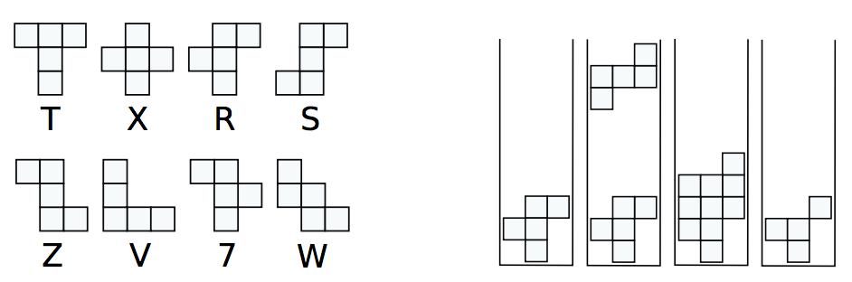

## 문제

FallingBlocks is a Tetris-like arcade game, played on a board with 3 columns and 10 rows according to the following rules. A known, indefinitely repeating sequence of pentominoes (simply called pieces) fall down from the top of the board, one at a time. The 8 pieces and their labels are shown above.

The pieces can be rotated freely (by 0, 90, 180 or 270 degrees), but they cannot flipped.

The rules are similar to that of Tetris. The newly introduced piece falls from the top of the board as far as possible until it hits the bottom of the board or an existing block in the board. Then, any rows that are completely full are removed and rows above are moved down, with no further change in the rows themselves.

To illustrate this, consider an empty board, on which an `R` piece, followed by a `Z` piece, falls. If we drop the `R` piece without rotating, we end up with first board shown above. Dropping a rotated `Z` piece on top of it causes two rows to fill. These rows are removed, and the rows above are pushed downward. The final situation is as shown in the rightmost picture. The final position has a “hanging block;” this block does not fall any further at this point.

Unlike Tetris, the top three rows of the board must be completely empty in order to place a piece, i.e., if any of the top three rows is not empty after removing all rows that are full, the game is over.

The score is solely based on the number of pieces played on the board before the game is over. Given the sequence of pieces that repeats indefinitely, determine the maximum number of pieces that can be played.

Below are some example sequences of pieces, followed by explanation.

* `X`: Every drop of an `X` piece leaves two rows filled that cannot be removed by additional `X` pieces. After placing four pieces, we have eight non-empty rows left, so the next `X` piece cannot be placed. So the result is 4.
* `XXXXR`: The `R` piece could be rotated to not overlap the square left in the highest non-empty row, but our rule is that the top three rows must be completely empty to place any piece. So the result is 4.
* `VZV`: Two `V` pieces and a `Z` piece can be placed to clear the board, so this game can go on forever.

## 입력

The input consists of a single line that contains a single string, representing the sequence of pentominoes. The input sequence contains between 1 and 20 characters.

## 출력

Print, on a single line, the maximum number of pieces that can be played until no more piece can be placed on the board. If the game can continue indefinitely, print forever.
