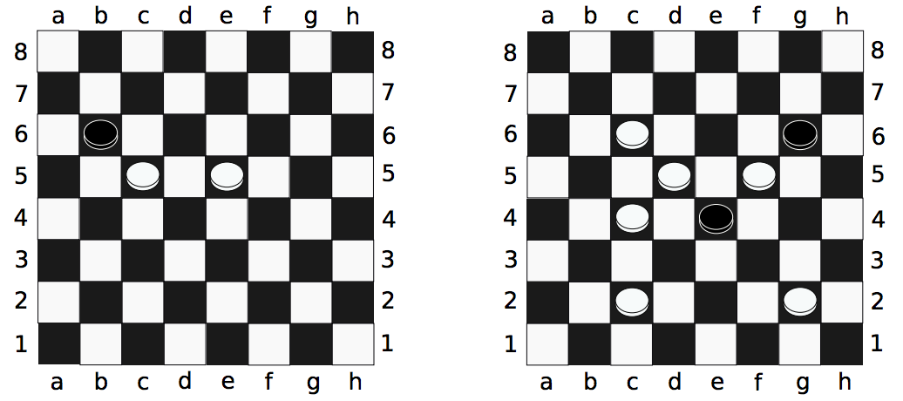

## 문제

Checkers is played on a n × n checkerboard (typically n equals 8, 10, or 12, but for this problem, n will range from 2 to 26). The board has squares colored red and black, and all pieces move only on the black squares. The two sides are called “Black” and “White,” and their pieces are so colored. The columns of the checkerboard are lettered starting with a on the left and increasing alphabetically. The rows are numbered 1, . . . , n, starting from the bottom. We refer to each square on the board by its label: the column letter followed by the row number, e.g., `c6`, `z10`, or `b26`. Two sample boards are given below (with additional labels to illustrate the column numbering).

A piece may jump diagonally over a piece of the other color to capture the piece (removing it from the board). In order to perform a jump, the piece that is jumped over must be diagonally adjacent to the piece performing a jump, and the square on the other side of the piece jumped over must be vacant. If such a capture is possible, the jumping piece may continue jumping and capturing pieces of the other color until no more jumps are possible.

For example, in the left sample board, the Black piece at position `b6` can capture both White pieces in a single move by first jumping over the White piece at `c5` (which moves the Black piece to `d4`), and then jumping over the White piece at `e5`, landing at `f6`. In the right sample board, no Black piece can jump any White pieces.

It is Black’s turn to move. Given a board of checkers, determine if it is possible for Black to jump all of White’s pieces in a single move.

## 입력

The first line of input contains n (2 ≤ n ≤ 26), the size of the board. The following n lines of n characters describe the board. Red squares (to which no piece can ever move) are labeled with ‘.’. Black squares with no pieces are labeled with ‘\_’. Black pieces are labeled with ‘B’, and White pieces are labeled with ‘W’.

It is guaranteed that the given board has at least one Black piece and one White piece. Additionally, the board is guaranteed to be well-formed; that is, no piece is on a red square, and the board is correctly colored.

## 출력

Print, on a single line, the location of the Black piece that can capture all of White’s pieces in a single move. If there are multiple such Black pieces, print Multiple. If there is no such Black piece, print None.
