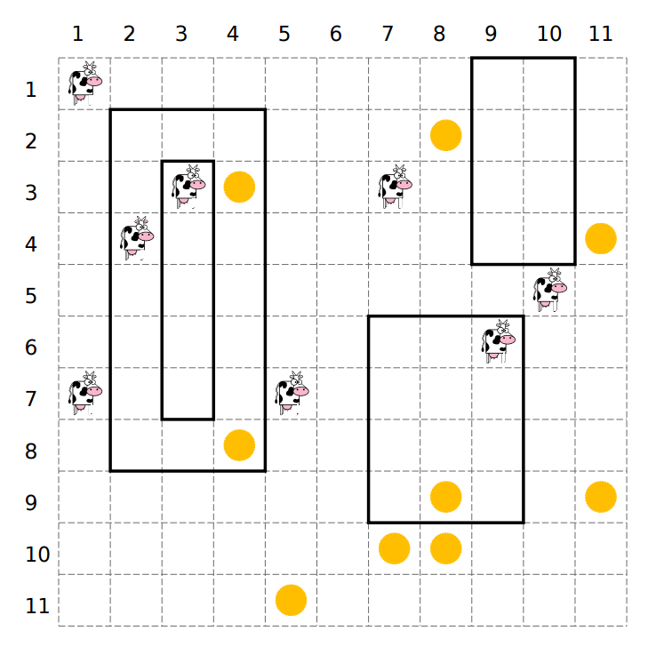

## 문제

A nearby pasture can be represented as a rectangular grid consisting of 106 rows and 106 columns. The rows are numbered with integers 1 through 106 top to bottom, the columns with integers 1 through 106 left to right.

A herd of n cows is scattered through the grid, each cow occupying a unit square. The pasture also contains m dandelion flowers (which cows like), again each occupying a unit square. Finally, the pasture contains p fences, each a rectangle running along the edges of unit squares. Fences do not intersect or touch. However, a fence may contain other fences inside the enclosed area.

Due to unfavorable wind conditions, cows can only move in two directions – down or right. Cows can go through squares occupied by other cows or flowers, but cannot cross fences.

For each cow, find the total number of flowers reachable from its present location.

## 입력

Input contains three blocks – the first block describes fences, the second one flowers and the third one cows.

The first line of the first block contains an integer f (0 ≤ f ≤ 200 000) – the number of fences. Each of the following f lines contains four integers r1, c1, r2, c2 (1 ≤ r1, c1, r2, c2 ≤ 106) describing a single fence – r1 and c1 are the coordinates (row and column) of the upper-left corner square inside the fence, while r2 and c2 are the coordinates of the lower-right corner square inside the fence. No two fences will intersect or touch.

The first line of the second block contains an integer m (0 ≤ m ≤ 200 000) – the number of flowers. The k-th of the following m lines contains two integers r and c (1 ≤ r, c ≤ 106) – the location of the k-th flower. No two flowers will occupy the same location.

The first line of the third block contains an integer n (1 ≤ n ≤ 200 000) – the number of cows. The k-th of the following n lines contains two integers r and c (1 ≤ r, c ≤ 106) – the location of the k-th cow. No two cows will occupy the same location, and no flower and cow will occupy the same location.

## 출력

Output should consist of n lines. The k-th line should contain a single integer – the total number of flowers reachable from the location of the k-th cow.

## 힌트

