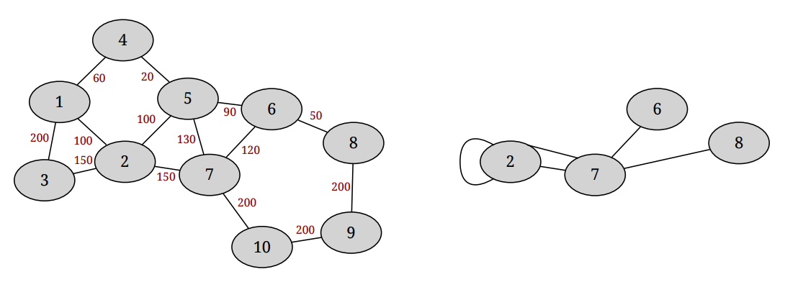

## 문제

Luka owns a geographic data company that maintains a detailed city map and exports the data to interested parties. Often, clients do not want the complete map. Instead, they want a simplified map containing only major streets.

City map is an undirected graph consisting of n intersections denoted with integers from 1 to n and m two-way streets. Each street is assigned a priority – a non-negative integer. When requesting a map, the client selects a threshold priority p. The original map is then copied and converted to the exported map using the following procedure:

1. All streets whose priority is lower than p are deleted.
2. For each intersection i from 1, 2, . . . , n (processed in that order):
   1. If the intersection i is not connected to any streets it is deleted.
   2. If the intersection i is connected to exactly two different streets x and y leading to intersections a and b both different from i then the intersection i is contracted using the following procedure:
      1. Streets x and y are deleted.
      2. Intersection i is deleted.
      3. New street z connecting intersections a and b is added.

Illustration of the second example with the threshold priority 95

Initially, the map does not contain loops (loop is a street that connects an intersection to itself) or parallel edges (more than one street between the same pair of intersections), but the loops and parallel edges may form during the contraction procedure. Notice that, in the step 2. (b) above, neither x nor y can be a loop (both a and b have to be different from i), but the newly added street z could be a loop (it is possible that a and b are same).

Given a map and a sequence of incoming export requests, for each request find the number of intersections and the number of streets in the exported map.

## 입력

The first line contains two integers n (1 ≤ n ≤ 300 000) and m (1 ≤ m ≤ 300 000) – the number of intersections and the number of streets, respectively. Each of the following m lines contains three integers a, b and p (1 ≤ a, b ≤ n, 0 ≤ p ≤ 300 000) which describe a street with priority p connecting intersections a and b. No street connects an intersection to itself. There is at most one street between every two intersections.

The following line contains an integer q (1 ≤ q ≤ 300 000) – the number of export requests. The following line contains q integers. The k-th integer tk (0 ≤ tk ≤ 300 000) is the threshold priority of the k-th request.

## 출력

Output should consist of q lines. The k-th line should contain two integers – the number of intersections and the number of streets, respectively, in the exported map for the k-th request.
