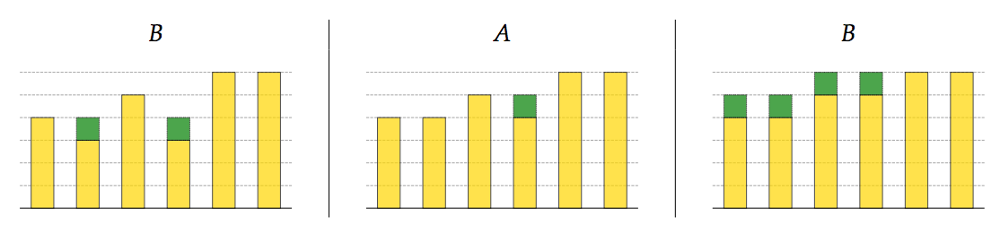

## 문제

You are switching from computer science to agriculture and your new job involves growing sunflowers in an underground greenhouse. The greenhouse contains n sunflower plants arranged in a straight line and numbered with integers 1 through n, from left to right. Two lamps provide the light and heat the sunflowers need to grow: the lamp A is positioned at the left end, while the lamp B is positioned at the right end of the line.

Every day exactly one of the lamps is on, causing all of the sunflowers to turn towards the light and some of them to grow. The sunflower will grow if and only if the sunflower directly in front of it (towards the light) is higher. The growth is continuous with a uniform rate of exactly 1 centimeter per day. Notice that, when a sunflower starts to grow, it may cause the sunflower directly behind it to start to grow instantaneously.

Example input: growth during the first three days of the period

You are given initial heights of the sunflowers and the lamp schedule for the following m day period, find the final heights of all the sunflowers.

## 입력

The first line contains two integers n and m (1 ≤ n, m ≤ 300 000) – the number of sunflowers and the number of days in the period. The following line contains n integers h1, h2, . . . , hn (1 ≤ hk ≤ 109) – the initial heights (in centimeters) of the sunflowers, from left to right.

The following line contains a string consisting of exactly m characters A or B – the lamp schedule starting from the first day of the period.

## 출력

Output a single line containing n integers – the final heights of the sunflowers, from left to right.
