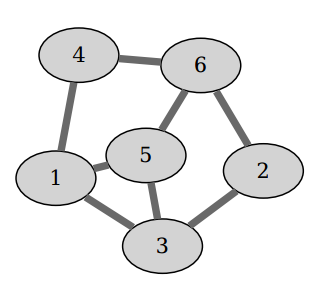
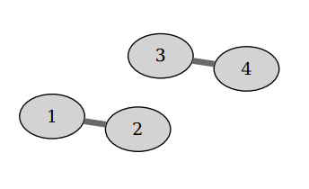

## 문제

You have been hired to upgrade an orange juice transport system in an old fruit processing plant. The system consists of pipes and junctions. All the pipes are bidirectional and have the same flow capacity of 1 liter per second. Pipes may join at junctions and each junction joins at most three pipes. The flow capacity of the junction itself is unlimited. Junctions are denoted with integers from 1 to n.

Before proposing the upgrades, you need to analyze the existing system. For two different junctions s and t, the s-t flow is defined as the maximum amount of juice (in liters per second) that could flow through the system if the source was installed at junction s and the sink at junction t. For example, in the system from the first example input below, the 1-6 flow is 3 while the 1-2 flow is 2.

Find the sum of all a-b flows for every pair of junctions a and b such that a < b.

## 입력

The first line contains two integers n and m (2 ≤ n ≤ 3 000, 0 ≤ m ≤ 4 500) – the number of junctions and the number of pipes. Each of the following m lines contains two different integers a and b (1 ≤ a, b ≤ n) which describe a pipe connecting junctions a and b.

Every junction will be connected with at most three other junctions. Every pair of junctions will be connected with at most one pipe.

## 출력

Output a single integer – the sum of all a-b flows for every pair of junctions a and b such that a < b.

## 힌트

