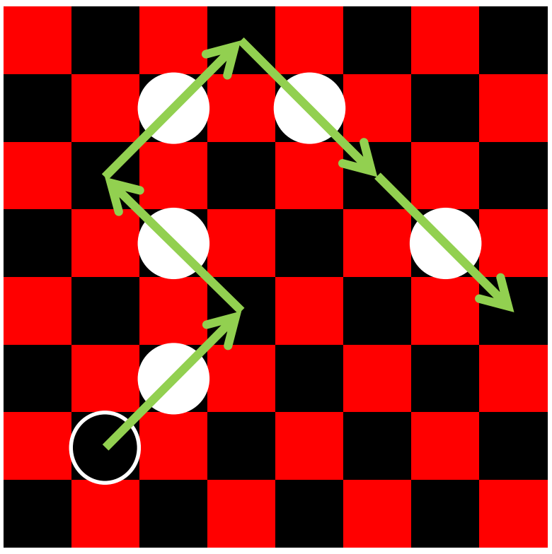

## 문제

Checkers is played on a square nxn grid (typically n equals 8, 10, or 12, but for this problem, n will range from 2 up to 26). The board has squares colored red and black, and all pieces move only on the black squares. Red and Black squares alternate, so that no two squares that share a side are ever of the same color. The two players are called Black and White, and their pieces are so colored. There are two kinds of pieces, Checkers and Kings, but for this problem, we will only be concerned with Kings. Kings may jump a piece of the other color in one diagonal hop, capturing the piece (removing it from the board). If such a capture is possible, the jumping piece may continue jumping and capturing pieces of the other color until no more jumps are possible. A King may jump in any of the four diagonal directions.

In order to perform a jump, the piece jumped must be immediately adjacent (diagonally) to the piece jumping, and the square on the other side of the jumped piece must be vacant.

In this problem, it is Black's turn to move. Given a position of checkers, you must determine if it is possible for a Black King to jump all of White's Kings in a single move, and if so, how many Black Kings are able to do so.

## 입력

Each input will consist of a single test case. Note that your program may be run multiple times on different inputs. The first line of input contains an integer n (2≤n≤26), the size of the board. The following n lines describe the board. Each line will contain exactly n characters, and each character will be one of ‘.’, ‘\_’, ‘B’, or ‘W’, indicating the contents of that square, as follows:

* . Indicates a Red square. No Kings may be placed on a Red square.
* \_ indicates a Black square that is unoccupied.
* B indicates a Black square with a Black King.
* W indicates a Black square with a White King.

You may assume that the given board is well-formed; that is, Black and Red squares will alternate through every row and every column, and no Kings will be on any Red square.

## 출력

Output a single integer indicating the number of Black Kings that can capture all of the White Kings in a single move.
