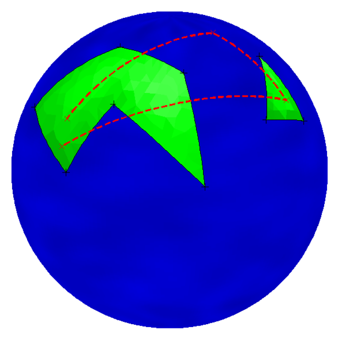

## 문제

When flying between two places, constructing a good flight plan is important. In general there is a wide range of different factors to consider, the most important being fuel consumption and weather forecasts (especially winds). In this problem, we will evaluate flight plans with respect to a third statistic, namely how much of the flight is over water, and how much is over ground. This statistic is not relevant per se, yet many passengers seem to prefer flying over land – either because they are afraid of flying over water, or simply because the view tends to be slightly more interesting when flying over land.

For this problem, we assume that the earth is a perfect sphere with radius 6370 km. We model each continent of the earth as a polygon on this sphere – a closed sequence of line segments, where a line segment between two points consists of the shortest spherical arc between these two points. The two end-points of a line segment can not be the same point, or antipodal (diametrically opposite) points. Similarly a flight route is modeled as a sequence of waypoints connected by line segments, but unlike the line segments of a polygon these line segments may cross themselves and will not necessarily end up where they started.

Figure F.1: The second sample input

In order to simplify the problem, we additionally make the following two assumptions:

* No waypoint of a flight route lies within 0.1 km of any shoreline (a line segment that is part of a polygon).
* No vertex of any continent polygon lies within 0.1 km of the flight route.

All coordinates on the sphere are represented as a pair of latitude and longitude (both in degrees). A point with latitude ±90 is the north/south pole, and points with latitude 0 are the points on the equator.

## 입력

The input consists of:

* one line with an integer 1 ≤ c ≤ 30, the number of continents;
* c lines, each describing a continent. Each such line starts with an integer 3 ≤ n ≤ 30, the number of vertices in the polygon describing the continent. This is followed by n pairs of integers φ1, λ1, . . . , φn, λn, where −90 ≤ φi ≤ 90 and 0 ≤ λi ≤ 359 are the latitude and longitude of the ith vertex of the continent;
* one line describing the flight plan. The line starts with an integer 2 ≤ m ≤ 30, the number of waypoints. This is followed by m pairs of integers φ1, λ1, . . . , φm, λm, where −90 ≤ φi ≤ 90 and 0 ≤ λi ≤ 359 are the latitude and longitude of the ith waypoint of the route.

A continent cannot cross itself. No continent will touch or contain any other continent. Continents are given in counterclockwise order, in the sense that if you go from the first vertex of the polygon to the second one, the interior of the continent is on your left hand side.

The first and last waypoints of the route will always be inside a continent (but not necessarily the same continent).

## 출력

Output two real numbers l and w, where l is the total length of the flight (in km), and w is the percentage of the flight that is over water. The numbers should be accurate to an absolute or relative error of at most 10−6.
