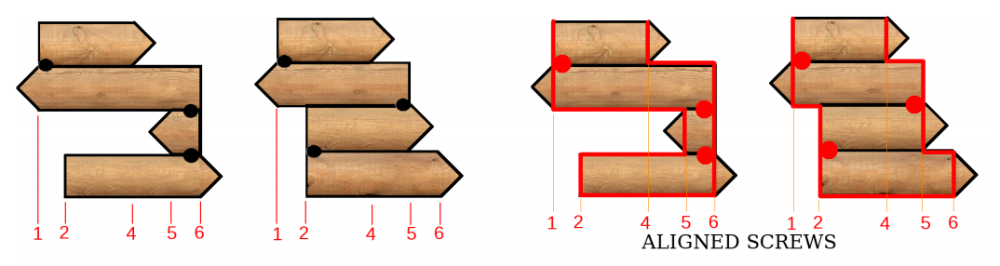
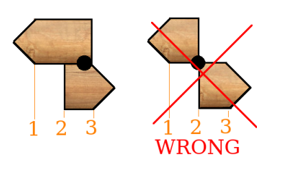

## 문제

A carpenter has received an order for a wooden directional sign. Each board must be aligned vertically with the previous one, either to the basis of the previous arrowhead or to the opposite side, being fixed there with a specially designed screw. The two boards must overlap.

The carpenter wrote down a sequence of integers to encode the sketch sent by the designer but the sequence does not determine a unique model and he has thrown away the original sketch. What looked like a trivial task turned out a big jigsaw to him.

The sequence (with 1 + N elements) encodes the (N) arrows from the bottom to the top of the sign. The first element is the position of the left side of the bottom arrow. The remaining N elements define the positions where the arrowheads start, from bottom to top: the i-th element is the position where the i-th arrowhead basis is. For instance, the two signs depicted (on the left and on the right) could be encoded by 2 6 5 1 4.

Since a board must be aligned vertically with the previous one (either to the basis of the previous arrowhead or to the opposite side), if the sequence was 2 6 5 1 4 3, the fifth arrow could be fixed (in any of the depicted signs) with a screw either at 1 (pointing to the right) or at 4 (pointing to the left), with the arrowhead basis at 3.

If the sequence was 2 3 1, the second arrow could only be fixed with a screw at 3, pointing to the left, because consecutive boards must overlap.

All arrowheads are similar and the designer told the carpenter that their bases stand in different vertical lines, as well as the left side of the bottom arrow, altogether forming a permutation of 1..(N +1). That is why the carpenter overlooked the details and just wrote down the permutation (e.g., 2 6 5 1 4 3).

Given the sequence of numbers the carpenter wrote down, compute the number of directional arrows signs that can be crafted. Since the number can be very large, you must write it modulo 231 −1 = 2147483647. The second integer in the sequence is always greater than the first one (the bottom arrow points to the right always).

## 입력

The first line has one integer N and the second line contains a permutation of the integers from 1 to N + 1. Integers in the same line are separated by a single space.

## 출력

The output has a single line with the number (modulo 231 − 1 = 2147483647) of distinct signs that can be described by the given permutation.
