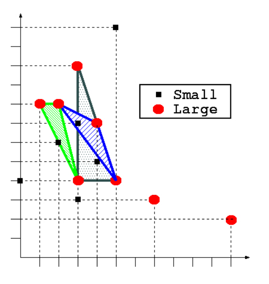

## 문제

Porto’s Festa de São João is one of Europe’s liveliest street festivals. Its peak is the night of 23rd to 24th of June, with dancing parties from Ribeira to Foz all night long.

Time to celebrate, with friends, relatives, neighbours or simply with other people in streets, armed with colored plastic hammers, huge garlic flowers or a bunch of lemongrass to gently greet passers-by. Fireworks, grilled sardines, barbecues, bonfires, potted basil plants (manjericos) and the sky covered by incandescent sky lanterns (balões de S.João) launched from every corner make this party unique.

The sky lanterns are made of thin paper and cannot be released until they are filled in with hot air. Sometimes they burn out still on ground or on the way up, if a sudden gust of wind catches them. For this reason, the successful launchers usually follow the movement of their sky lanterns, with a mixture of anxiety and joy, for as long as they can distinguish them in the sky.

We are not aware of any attempt to achieve a Guinness record of sky lanterns launched simultaneously (it could be dreadful night for firemen if there were).

Can you imagine, thousands of people preparing their sky lanterns for release at the city park, within a region of larger ones that will be launched simultaneously?

The large sky lanterns can be used to identify their positions in the sky afterwards, in order to count the surviving ones at an observation instant.

Given the positions of the large sky lanterns and the positions of the small ones, determine the number of small sky lanterns that are in the interior or on the boundary of some triangle defined by any three of the large ones.

## 입력

The first line has an integer L that defines the number of the large sky lanterns at the observation instant. Each of the following L lines contains a pair of integers separated by a space that gives the coordinates (x, y) of a large sky lantern. After that, there is a line with an integer S that defines the number of small sky lanterns and S lines, each defining the position of a small sky lantern. The height is irrelevant for us. All the given points are distinct and there are at least three points representing large sky lanterns that are not collinear.

## 출력

The output has a single line with the number of small sky lanterns that are in the interior or on the boundary of some triangle defined by any three of the large sky lanterns.

## 힌트

