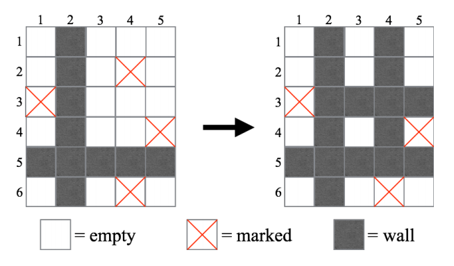

## 문제

The game Wall Making Game, a two-player board game, is all the rage.

This game is played on an H × W board. Each cell of the board is one of empty, marked, or wall. At the beginning of the game, there is no wall on the board.

In this game, two players alternately move as follows:

1. A player chooses one of the empty cells (not marked and not wall). If the player can’t choose a cell, he loses.
2. Towards each of the four directions (upper, lower, left, and right) from the chosen cell, the player changes cells (including the chosen cell) to walls until the player first reaches a wall or the outside of the board.

Note that marked cells cannot be chosen in step 1, but they can be changed to walls in step 2.

Fig.1 shows an example of a move in which a player chooses the cell at the third row and the fourth column.

fig.1: An example of a move in Wall Making Game.

Your task is to write a program that determines which player wins the game if the two players play optimally from a given initial board.

## 입력

The first line of the input consists of two integers H and W (1 ≤ H, W ≤ 20), where H and W are the height and the width of the board respectively. The following H lines represent the initial board. Each of the H lines consists of W characters.

The j-th character of the i-th line is ‘.’ if the cell at the j-th column of the i-th row is empty, or ‘X’ if the cell is marked.

## 출력

Print “First” (without the quotes) in a line if the first player wins the given game. Otherwise, print “Second” (also without the quotes) in a line.
