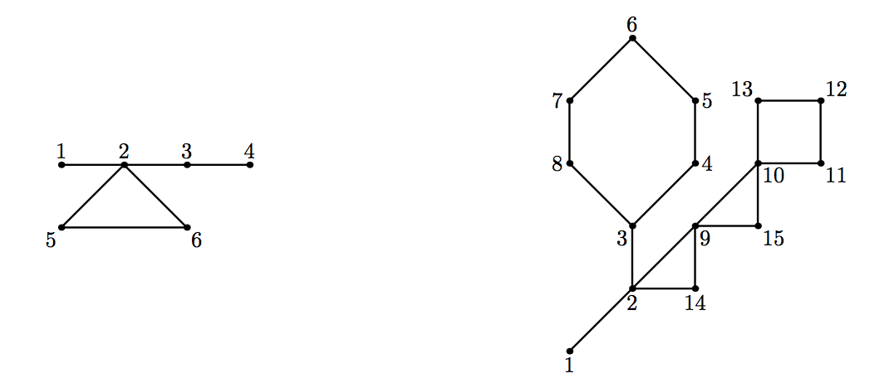

## 문제

This is the 20-th Northeastern European Regional Contest (NEERC). Cactus problems had become a NEERC tradition. The first Cactus problem was given in 2005, so there is a jubilee — 10 years of Cactus.

*Cactus* is a connected undirected graph in which every edge lies on at most one simple cycle. Intuitively cactus is a generalization of a tree where some cycles are allowed. Multiedges (multiple edges between a pair of vertices) and loops (edges that connect a vertex to itself) are not allowed in a cactus.

You are given a cactus. Let’s *move* an edge — remove one of graph’s edges, but connect a different pair of vertices with an edge, so that a graph still remains a cactus. How many ways are there to perform such a move?

For example, in the left cactus above (given in the first sample), there are 42 ways to perform an edge move. In the right cactus (given in the second sample), which is the classical NEERC cactus since the original problem in 2005, there are 216 ways to perform a move.

## 입력

The first line of the input file contains two integers n and m (1 ≤ n ≤ 50 000, 0 ≤ m ≤ 50 000). Here n is the number of vertices in the graph. Vertices are numbered from 1 to n. Edges of the graph are represented by a set of edge-distinct paths, where m is the number of such paths.

Each of the following m lines contains a path in the graph. A path starts with an integer ki (2 ≤ ki ≤ 1000) followed by ki integers from 1 to n. These ki integers represent vertices of a path. Adjacent vertices in a path are distinct. Path can go to the same vertex multiple times, but every edge is traversed exactly once in the whole input file.

The graph in the input file is a cactus.

## 출력

Write to the output file a single integer — the number of ways to move an edge in the cactus.
