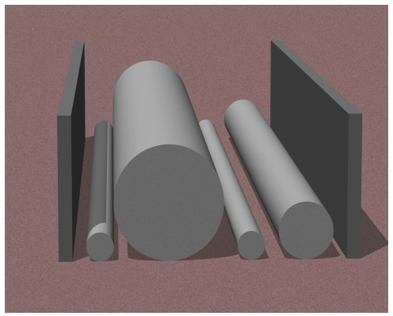

## 문제

Laid on the flat ground in the stockyard are a number of heavy metal cylinders with (possibly) different diameters but with the same length. Their ends are aligned and their axes are oriented to exactly the same direction.

We’d like to minimize the area occupied. The cylinders are too heavy to lift up, although rolling them is not too difficult. So, we decided to push the cylinders with two high walls from both sides.

Your task is to compute the minimum possible distance between the two walls when cylinders are squeezed as much as possible. Cylinders and walls may touch one another. They cannot be lifted up from the ground, and thus their order cannot be altered.

Figure B.1. Cylinders between two walls

## 입력

The input consists of a single test case. The first line has an integer N (1 ≤ N ≤ 500), which is the number of cylinders. The second line has N positive integers at most 10,000. They are the radii of cylinders from one side to the other.

## 출력

Print the distance between the two walls when they fully squeeze up the cylinders. The number should not contain an error greater than 0.0001.

## 힌트

The following figures correspond to the Sample 1, 2, and 3.

|  |  |  |
| --- | --- | --- |
|  |  |  |
| Figure B.2. Sample 1 | Figure B.3. Sample 2 | Figure B.4. Sample 3 |
