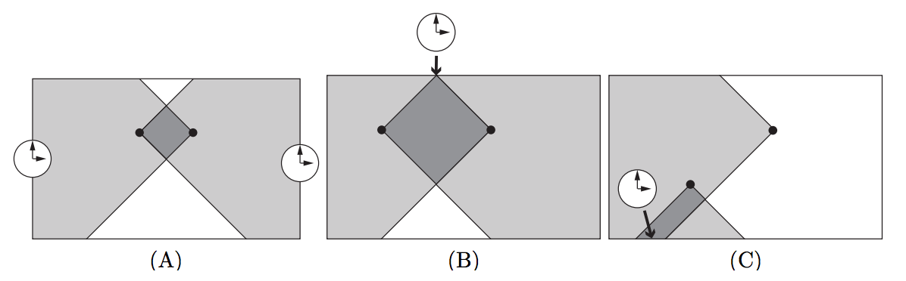

## 문제

You are the manager of a chocolate sales team. Your team customarily takes tea breaks every two hours, during which varieties of new chocolate products of your company are served. Everyone looks forward to the tea breaks so much that they frequently give a glance at a wall clock.

Recently, your team has moved to a new office. You have just arranged desks in the office. One team member asked you to hang a clock on the wall in front of her desk so that she will not be late for tea breaks. Naturally, everyone seconded her.

You decided to provide an enough number of clocks to be hung in the field of view of everyone. Your team members will be satisfied if they have at least one clock (regardless of the orientation of the clock) in their view, or, more precisely, within 45 degrees left and 45 degrees right (both ends inclusive) from the facing directions of their seats. In order to buy as few clocks as possible, you should write a program that calculates the minimum number of clocks needed to meet everyone’s demand.

The office room is rectangular aligned to north-south and east-west directions. As the walls are tall enough, you can hang clocks even above the door and can assume one’s eyesight is not blocked by other members or furniture. You can also assume that each clock is a point (of size zero), and so you can hang a clock even on a corner of the room.



Figure D.1. Arrangements of seats and clocks. Gray area indicates field of view.

For example, assume that there are two members. If they are sitting facing each other at positions shown in Figure D.1(A), you need to provide two clocks as they see distinct sections of the wall. If their seats are arranged as shown in Figure D.1(B), their fields of view have a common point on the wall. Thus, you can meet their demands by hanging a single clock at the point. In Figure D.1(C), their fields of view have a common wall section. You can meet their demands with a single clock by hanging it anywhere in the section. Arrangements (A), (B), and (C) in Figure D.1 correspond to Sample Input 1, 2, and 3, respectively.

## 입력

The input consists of a single test case, formatted as follows.

```

n w d
x1 y1 f1
.
.
.
xn yn fn
```

All numbers in the test case are integers. The first line contains the number of team members n (1 ≤ n ≤ 1, 000) and the size of the office room w and d (2 ≤ w, d ≤ 100, 000). The office room has its width w east-west, and depth d north-south. Each of the following n lines indicates the position and the orientation of the seat of a team member. Each member has a seat at a distinct position (xi, yi) facing the direction fi, for i = 1, . . . , n. Here 1 ≤ xi ≤ w − 1, 1 ≤ yi ≤ d − 1, and fi is one of N, E, W, and S, meaning north, east, west, and south, respectively. The position (x, y) means x distant from the west wall and y distant from the south wall.

## 출력

Print the minimum number of clocks needed.
