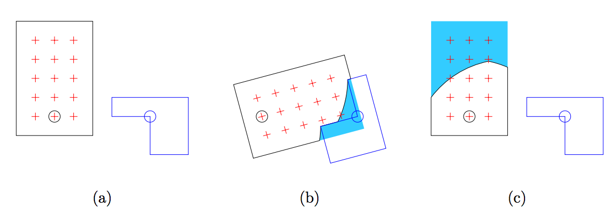

## 문제

The machine tool technology never stops its development. One of the recent proposals is more flexible lathes in which not only the workpiece but also the cutter bit rotate around parallel axles in synchronization. When the lathe is switched on, the workpiece and the cutter bit start rotating at the same angular velocity, that is, to the same direction and at the same rotational speed. On collision with the cutter bit, parts of the workpiece that intersect with the cutter bit are cut out.

To show the usefulness of the mechanism, you are asked to simulate the cutting process by such a lathe.

Although the workpiece and the cutter bit may have complex shapes, focusing on cross sections of them on a plane perpendicular to the spinning axles would suffice. We introduce an xycoordinate system on a plane perpendicular to the two axles, in which the center of rotation of the workpiece is at the origin (0, 0), while that of the cutter bit is at (L, 0). You can assume both the workpiece and the cutter bit have polygonal cross sections, not necessarily convex.

Note that, even when this cross section of the workpiece is divided into two or more parts, the workpiece remain undivided on other cross sections.

We refer to the lattice points (points with both x and y coordinates being integers) strictly inside, that is, inside and not on an edge, of the workpiece before the rotation as points of interest, or POI in short.

Our interest is in how many POI will remain after one full rotation of 360 degrees of both the workpiece and the cutter bit. POI are said to remain if they are strictly inside the resultant workpiece. Write a program that counts them for the given workpiece and cutter bit configuration.



Figure H.1. The workpiece and the cutter bit in Sample 1

Figure H.1(a) illustrates the workpiece (in black line) and the cutter bit (in blue line) given in Sample Input 1. Two circles indicate positions of the rotation centers of the workpiece and the cutter bit. The red cross-shaped marks indicate the POI.

Figure H.1(b) illustrates the workpiece and the cutter bit in progress in case that the rotation direction is clockwise. The light blue area indicates the area cut-off.

Figure H.1(c) illustrates the result of this sample. Note that one of POI is on the edge of the resulting shape. You should not count this point. There are eight POI remained.

## 입력

The input consists of a single test case with the following format.

```

M N L
xw1 yw1
.
.
.
xwM ywM
xc1 yc1
.
.
.
xcN ycN
```

The first line contains three integers. M is the number of vertices of the workpiece (4 ≤ M ≤ 20) and N is the number of vertices of the cutter bit (4 ≤ N ≤ 20). L specifies the position of the rotation center of the cutter bit (1 ≤ L ≤ 10000).

Each of the following M lines contains two integers. The i-th line has xwi and ywi, telling that the position of the i-th vertex of the workpiece has the coordinates (xwi, ywi). The vertices are given in the counter-clockwise order.

N more following lines are positions of the vertices of the cutter bit, in the same manner, but the coordinates are given as offsets from its center of rotation, (L, 0). That is, the position of the j-th vertex of the cutter bit has the coordinates (L + xcj, ycj).

You may assume −10000 ≤ xwi, ywi, xcj , ycj ≤ 10000 for 1 ≤ i ≤ M and 1 ≤ j ≤ N.

All the edges of the workpiece and the cutter bit at initial rotation positions are parallel to the x-axis or the y-axis. In other words, for each i (1 ≤ i ≤ M), xwi = xwi' or ywi = ywi' holds, where i' = (i mod M) + 1. Edges are parallel to the x- and the y-axes alternately. These can also be said about the cutter bit.

You may assume that the cross section of the workpiece forms a simple polygon, that is, no two edges have common points except for adjacent edges. The same can be said about the cutter bit. The workpiece and the cutter bit do not touch or overlap before starting the rotation.

Note that (0, 0) is not always inside the workpiece and (L, 0) is not always inside the cutter bit.

## 출력

Output the number of POI remaining strictly inside the workpiece.
