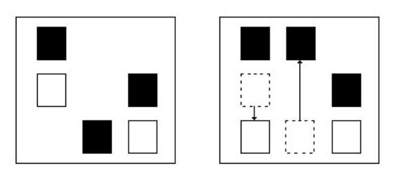

## 문제

Well, it’s time. Andrew has been accumulating file after file on his computer and could never bring himself to delete any single one of them (“You know Algol might make a comeback, so I better not delete any of those files” is one of a large number of his justifications). But he realizes that not only is it wasting a lot of disk space, but it’s making it hard to find anything when he displays his files on the screen as icons.

Because of the sheer number of files that must be gotten rid of, Andrew would like to use as few delete operations as possible. He can delete multiple files at one time if their icons are all clustered together in a rectangular area on his screen by using the mouse to outline a box around them and then hitting delete (an icon is considered in the box if its center is in the box). This also requires that there are no icons in the box of files that he wants to keep. He figures that maybe if he moves file icons around, he can easily put all of the icons into such a rectangular area, perhaps moving some icons out as well.

For example, in the figure below there are three files to delete (black icons) and two to keep (white icons). By moving two of them as shown in the figure on the right, all of the three icons of files to be deleted can be grouped together for one delete operation (note that there are many other ways to move two icons to accomplish this, but no way to do it by just moving one).

Figure B.1

Since he must clean out every directory in his file system, he would like to know the following: given a layout of file icons on the screen, what is the minimum number of icons to move so that he can delete all of the appropriate files with one delete command?

## 입력

The input will start with four integers nr nc n m which indicate the number of pixel rows and columns in the screen (1 ≤ nr, nc ≤ 10000), the number of file icons on the screen to be deleted (n) and the number of file icons on the screen that should not be deleted (m), where n + m ≤ 100. After this will be a set of 2(n + m) integers indicating the location of the n + m files, the first n of which are the files to be deleted. Each pair of numbers r c will specify the row and col of the upper left corner of the file icon, where 0 ≤ r < nr and 0 ≤ c < nc. All icons are 15 pixels high by 9 pixels wide in size and no two icons will be at the same location, though they may overlap, and at least one pixel of the icon must always reside on the screen (both initially and after they’ve been moved). Edges of a delete rectangle lie on pixel boundaries.

## 출력

Output the minimum number of file icons that must be moved in order to delete all the appropriate files in one delete operation.
