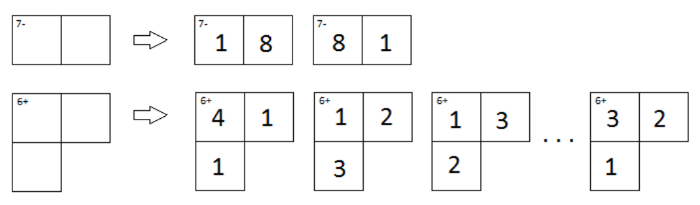

## 문제

KenKen is a popular logic puzzle developed in Japan in 2004. It consists of an n × n grid divided up into various non-overlapping sections, where each section is labeled with an integer target value and an arithmetic operator. The object is to fill in the entire grid with the numbers in the range 1 to n such that

* no number appears more than once in any row or column
* in each section you must be able to reach the section’s target using the numbers in the section and the section’s arithmetic operator

For this problem we are only interested in single sections of a KenKen puzzle, not the entire puzzle. Two examples of sections from an 8 × 8 KenKen puzzle are shown below along with some of their possible assignments of digits.

Figure C.1

Note that while sections labeled with a subtraction or division operator can consist of only two grid squares, those labeled with addition or multiplication can have any number. Also note that in a 9 × 9 puzzle the first example would have two more solutions, each involving the numbers 9 and 2. Finally note that in the first solution of the second section you could not swap the 1 and 4 in the first row, since that would result in two 1’s in the same column.

You may be wondering: for a given size KenKen puzzle and a given section in the puzzle, how many valid ways are there to fill in the section? Well, stop wondering and start programming!

## 입력

The input will start with a single line of the form n m t op, where n is the size of the KenKen puzzle containing the section to be described, m is the number of grid squares in the section, t is the target value and op is either ‘+’, ‘-’, ‘\*’ or ‘/’ indicating the arithmetic operator to use for the section.

Next will follow m grid locations of the form r c, indicating the row and column number of the grid square. These grid square locations will take up one or more lines.

All grid squares in a given section will be connected so that you can move from any one square in the section to any other by crossing shared lines between grid squares.

The values of n, m and t will satisfy 4 ≤ n ≤ 9, 2 ≤ m ≤ 10, 0 < t and 1 ≤ r, c ≤ n.

## 출력

Output the number of valid ways in which the section could be filled in for a KenKen puzzle of the given size.
