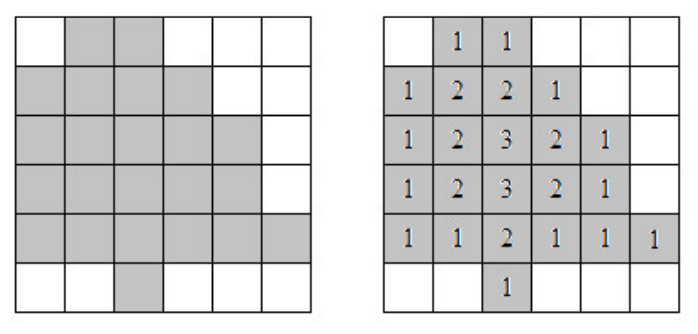

## 문제

Dee Siduous is a botanist who specializes in trees. A lot of her research has to do with the formation of tree rings, and what they say about the growing conditions over the tree’s lifetime. She has a certain theory and wants to run some simulations to see if it holds up to the evidence gathered in the field.

One thing that needs to be done is to determine the expected number of rings given the outline of a tree. Dee has decided to model a cross section of a tree on a two dimensional grid, with the interior of the tree represented by a closed polygon of grid squares. Given this set of squares, she assigns rings from the outer parts of the tree to the inner as follows: calling the non-tree grid squares “ring 0”, each ring n is made up of all those grid squares that have at least one ring (n − 1) square as a neighbor (where neighboring squares are those that share an edge).

An example of this is shown in the figure below.

Figure D.1

Most of Dee’s models have been drawn on graph paper, and she has come to you to write a program to do this automatically for her. This way she’ll use less paper and save some . . . well, you know.

## 입력

The input will start with a line containing two positive integers n m specifying the number of rows and columns in the tree grid, where n, m ≤ 100. After this will be n rows containing m characters each. These characters will be either ‘T’ indicating a tree grid square, or ‘.’.

## 출력

Output a grid with the ring numbers. If the number of rings is less than 10, use two characters for each grid square; otherwise use three characters for each grid square. Right justify all ring numbers in the grid squares, and use ‘.’ to fill in the remaining characters.

If a row or column does not contain a ring number it should still be output, filled entirely with ‘.’s.
