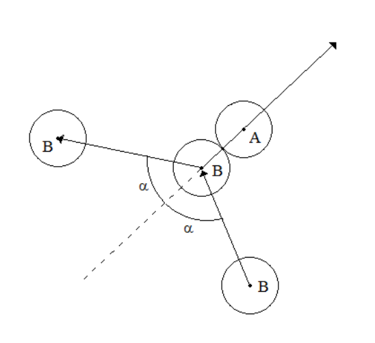
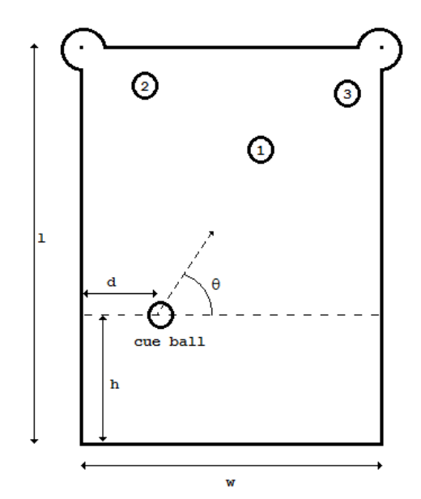

## 문제

Your game development studio, Ad Hoc Entertainment, is currently working on a billiards-based app they’re calling Pool Shark. Players face a sequence of increasingly devious pool puzzles in which they need to carefully position and aim a single billiards shot to sink multiple pool balls.

You’ve just done the first round of user testing and the feedback is terrible — players complain that the physics of your pool game is neither fun nor intuitive. After digging into it, you realize that the problem isn’t that your physics code is bad, but rather that most people just don’t have much intuition about how physics works. Fortunately, no one requires your physics to be realistic. After this liberating realization, your team experiments with a few models, eventually settling on the following rule for how to resolve pool-ball collisions:

When a moving pool ball B hits a stationary ball A, A begins moving in the direction given by the vector from the center of B to the center of A at the time of the collision. Ball B’s new velocity vector is B’s original vector reflected across A’s new vector (Figure H.1). Note that A’s resulting vector is what real physics predicts, but B’s is not (unless A is glued to the table or has infinite mass). For the purposes of this problem, the speed at which the balls move is irrelevant.

Figure H.1

Figure H.2

This actually allows for more interesting challenges, but requires new code to determine whether a particular level is feasible. You’ve been tasked with solving a very particular case:

Three balls labelled 1, 2, and 3 are placed on a table with width w and length l (Figure H.2). The player must place the cue ball somewhere on a dashed line lying h units above the bottom edge of the table. The goal is to pick a distance d from the left side, and an angle θ such that when the cue ball is shot, the following events happen:

* The cue ball strikes ball 1, and then ricochets into ball 2, sinking ball 2 in the top left hole.
* Ball 1, having been struck by the cue ball, hits ball 3, sinking ball 3 in the top right hole.

For simplicity, assume that sinking a ball requires the center of the ball to pass directly over the center of the hole. Further assume that the table has no sides — a ball that goes out of the w-by-l region simply falls into a digital abyss — and thus you don’t need to worry about balls colliding with the table itself.

You need to write a program that, given values for w, l, h, the position of balls 1–3, and the radius r of the balls, determines whether the trick shot is possible.

## 입력

The input begins with a line containing two positive integers w l, the width and length of the pool table, where w, l ≤ 120. The left hole is at location (0, l) and the right hole is at location (w, l).

The next line will contain 8 positive integers r x1 y1 x2 y2 x3 y3 h, where r ≤ 5 is the radius of all the balls (including the cue ball), xi yi is the location of ball i, 1 ≤ i ≤ 3, and h is the distance the dashed line is from the front of the pool table (see the figure above, where r ≤ h ≤ (1/2)l). No two balls will ever overlap, though they may touch at a point, and all balls will lie between the dashed line and the back of the table. All balls will lie completely on the table, and the cue ball must also lie completely on the table (otherwise the shot is impossible).

## 출력

For each test case, display the distance d to place the ball on the dashed line and the angle θ to shoot the ball, or the word “impossible” if the trick shot cannot be done. Output θ in degrees, and round both d and θ to the nearest hundredth. Always show two digits after the decimal point, even if the digits are zero.
