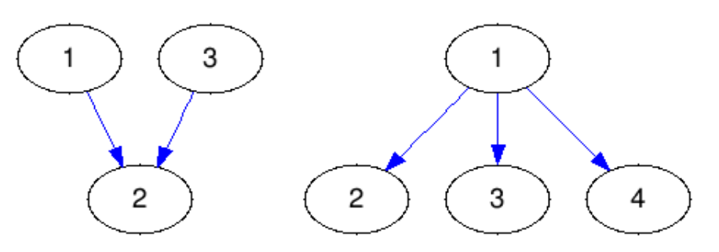

## 문제

Scientists in a chemical lab in Croatia have been studying the chemical bonds between different molecules. They have a special interest in a group of molecules of the chemical compound nitro hydrogen laminate.

The compound consists of N molecules bound together by N − 1 covalent bonds and all the molecules are directly or indirectly tied together with bonds in a single structure.

The scientists want to modify the compound in a way that all the covalent bonds are transformed into directed covalent bonds. Because of the instability of the newly created compound, each molecule will have a large number of impulses coming out of it and travelling to other molecules using the directed bonds. An impulse can travel using the directed covalent bond only in the direction of the bond itself.

The instability of the compound is defined as the largest possible number of bonds a single impulse can use to travel. The scientists want to direct the compound’s covalent bonds in a way that the newly created compound is as stable as possible. In other words, their goal is to create a compound with the minimal longest path an impulse can take during its travel.

Help the scientists determine the direction of each covalent bond in the compound.

## 입력

The first line of input contains the integer N (2 ≤ N ≤ 100 000).

Each of the N − 1 lines contains the integers ai and bi (1 ≤ ai, bi ≤ N) that denote that molecules ai and bi are connected with a covalent bond.

## 출력

Output N − 1 lines, where each line must contain 1 if the covalent bond is going to be directed from ai to bi, otherwise it contains 0.

If there are multiple possible solutions, output any.

## 힌트

Clarification of the first sample: The example corresponds to the left image from the task. The longest path an impulse can take is 1. Notice that 0 1 is also a correct solution.

Clarification of the second sample: The example corresponds to the right image from the task.
