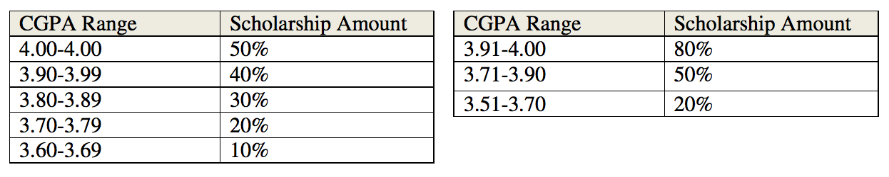

## 문제

A university gives scholarship to students based on their current CGPA. This waiver allocation follows some rules. At the beginning of a semester allotted scholarships for certain CGPA range is put on the notice board in tabular form. Two such tables are shown below:

In the table on the left it is said that students who have CGPA within 3.60 and 3.69 (inclusive) will get 10% of their tuition fee as scholarship. Similarly, those with CGPA range is within 3.90-3.99 will get 40% of their tuition fee as scholarship. Using the two tables above we will try to explain to you the rules and restrictions of allocating waiver:

1. A fixed Scholarship is given to all the students within a CGPA Range.
2. The range of each CGPA slab must be equal (Except the topmost one, which can be smaller). The slabs must go all the way up to 4.00.
3. The scholarship percentage for the lowest slab is a positive integer. With the increase of CGPA range the amount of scholarship percentage must also increase by a fixed positive integer value. In the table on the left this fixed value is 10% and in the table on the right this fixed value is 30%.
4. Scholarship percentage for each slab is always a positive integer with a maximum value of 100%.
5. The scholarship amount that can give 1 student 1 % scholarship is called a unit. So to give 2 students 50% scholarship, 50\*2 = 100 units is needed.
6. All the scholarships given should use up a given amount, P units.
7. A CGPA range for scholarship cannot start below 2.50. So 2.50-2.55 is a valid CGPA range but 2.45-2.55 is not valid.
8. There must be at least 2 slabs for scholarship. But of course a slab can contain zero students.

Given the number of students, total available scholarship units and their current CGPA, your job is to find out the number of different possible scholarship allocations that uses up all the scholarship units. Two scholarship allocations are different if their CGPA range is different or scholarship allocation in any slab is different.

## 입력

Input file contains at most 100 sets of inputs. The description of each set is given below:

Each set starts with two integers N (N<=10000) which indicates the total number of students and P which indicates the scholarship units that needs to be used up. Each of the next N lines contains the CGPA of one student.

Input is terminated by a line containing two zeroes.

## 출력

For each test case produce one line of output which contains an integer D. This D denotes the total number of different scholarship allocations that uses up all P units. Input will be such that there will always be at least one possible allocation.

## 힌트

//a = 10 d = 10 lowest = 2.88 nslab = 8 wslab = 14

One possible solution to the sample input above is

| CGPARange | # of students | Waiver % | Total Units needed |
| --- | --- | --- | --- |
| 3.93-4.00 | 2 | 80 | 160 |
| 3.78-3.92 | 0 | 70 |  |
| 3.63-3.77 | 3 | 60 | 180 |
| 3.48-3.62 | 0 | 50 |  |
| 3.33-3.47 | 0 | 40 |  |
| 3.18-3.32 | 2 | 30 | 60 |
| 3.03-3.17 | 0 | 20 |  |
| 2.88-3.02 | 1 | 10 | 10 |
|  |  | Total Units | 410 |

There is another 79553 different allocation which uses up all 410 units exactly.
