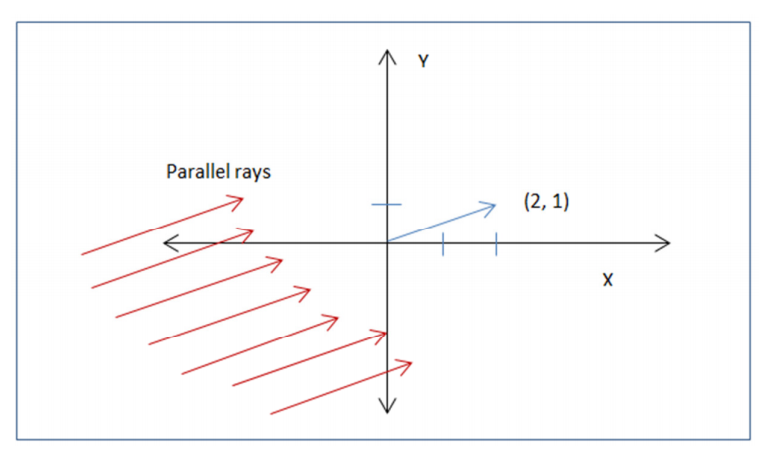
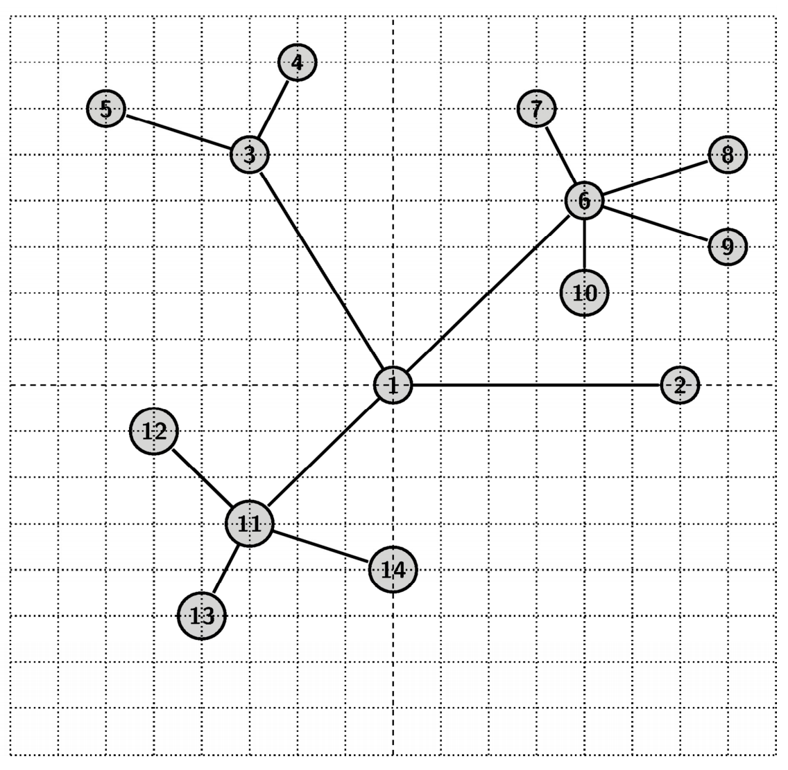

## 문제

Let’s take the top view of a tree. If you consider tree branches to be edges and the places where branches meet or end to be nodes, then it will be an embedding of a graph in 2D plane (not necessarily planar). Actually this graph is a tree. That is, the graph is connected but contains no cycle. In other words, this graph is connected and has n nodes (2D coordinates) with n - 1 edges.

Now you will be given a bunch of queries. Each query consists of 4 numbers “u v x y”. u and v refers to two nodes. (x, y) is the vector that indicates the direction of sunlight. The figure below shows an example of (x, y) = (2, 1). There is the sunlight coming from the lower left and the rays are parallel with the vector (2, 1). Please note that the sunlight is not a single ray. Rather it is a bunch of parallel rays moving from infinite towards a certain direction.

We think that a node is warmer if it is closer to sun. If an ant moves from node u to node v in the unique shortest path, which node(s) will be the warmest location for the ant?

Let’s give an example. Consider the above tree and a few queries:

1. u = 14, v = 4, x = 1, y = 0: The unique shortest path from u = 14 to v = 4 is: [14, 11, 1, 3, 4]. (x, y) = (1, 0) means sunlight is coming from left and going towards right. In this case, node 3 and 11 are closest to sun. So the output will be 3 and 11.
2. u = 13, v = 9, x = 1, y = -1: The unique shortest path from u = 13 to v = 9 is: [13, 11, 1, 6, 9]. (x, y) = (1, -1) means sunlight is coming from upper left corner and going towards lower right corner. In this case node 11, 1 and 6 are closest to sun. So the output will be: 1, 6 and 11.

## 입력

First line of the input will contain number of test cases T (T ≤ 10). Hence follows T test cases. Each test case starts with n, number of nodes in the tree (n<= 10^5). In the following n lines, there will be n 2d coordinate points (|x|, |y| <= 10^5). Next n - 1 lines will describe the edges of the tree by giving id (1 <= id <= n) of the two nodes that an edge connects. You may assume that the input will be a valid tree. In the next line a positive integer Q will be given (<= 1.6 \* 10^5) denoting number of queries. In the next Q lines, each query will be of the form “u v x y” (1 <= u, v <= n and |x|, |y| <= 10^5). Please note all the cases are not worst case but there is at least one case with the highest possible number of nodes and queries.

## 출력

For each test case print the case number, followed by the ids of the nodes that are hit by the sunlight first. If there are multiple points hit by the sunlight first, sort them by their id and print them in space separated way. Please do not put any space at the end or beginning of the line. You may consider that in total your code will print at most 3\*10^5 ids.
