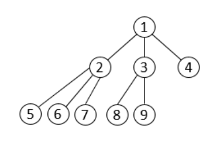

## 문제

각 노드가 자식을 최대 K개 가질 수 있는 트리를 K진 트리라고 한다. 총 N개의 노드로 이루어져 있는 K진 트리가 주어진다.

트리는 "적은 에너지" 방법을 이용해서 만든다. "적은 에너지" 방법이란, 이전 깊이를 모두 채운 경우에만, 새로운 깊이를 만드는 것이고, 이 새로운 깊이의 노드는 가장 왼쪽부터 차례대로 추가 한다.

아래 그림은 노드 9개로 이루어져 있는 3진 트리이다.

노드의 개수 N과 K가 주어졌을 때, 두 노드 x와 y 사이의 거리를 구하는 프로그램을 작성하시오.

## 입력

첫째 줄에 N (1 ≤ N ≤ 1015)과 K (1 ≤ K ≤ 1 000), 그리고 거리를 구해야 하는 노드 쌍의 개수 Q (1 ≤ Q ≤ 100 000)가 주어진다.

다음 Q개 줄에는 거리를 구해야 하는 두 노드 x와 y가 주어진다. (1 ≤ x, y ≤ N, x ≠ y)

## 출력

총 Q개의 줄을 출력한다. 각 줄에는 입력으로 주어진 두 노드 사이의 거리를 출력한다.
