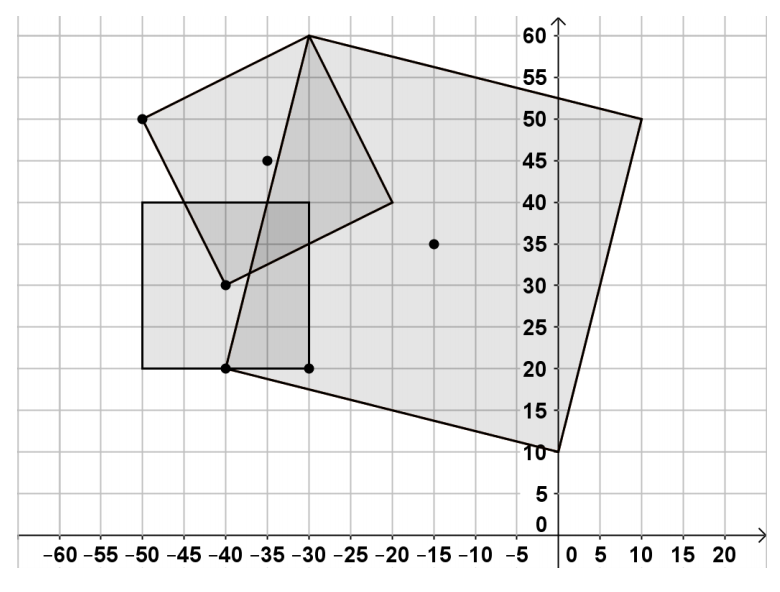

## 문제

We are given N squares in the plane, defined as their center and one of their vertices. Write a program squares to calculate the area covered by these squares.

## 입력

The first line at the standard input holds the integer N – the number of squares (0 < N < 10). Each of the next N lines holds 4 integers, separated by a space, each describing one of the squares. Each square is described by the coordinates of its center and the coordinates of one of its vertices. All coordinates are integers in the range [-50, 50].

## 출력

The program should print at the standard output a single line holding the result: the area covered by the squares, rounded to the nearest integer number.
