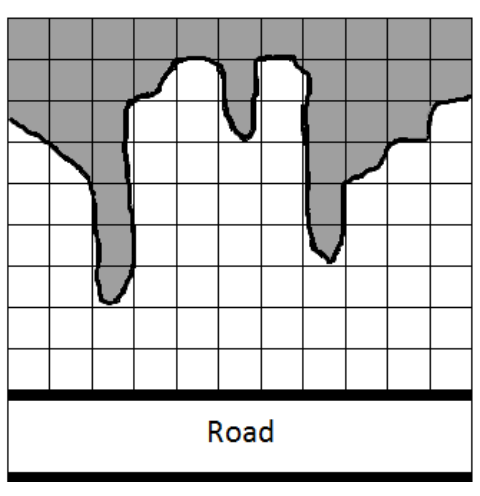

## 문제

It is well known that building a hotel near sea coast is very profitable. That is why the company International Ocean Investment bought a piece of earth on the Black See coast (similar to shown on the Figure) and would like to build a hotel – as big as possible. By different reasons the hotel has to be with rectangular basement. That is why the company searches somebody to find the rectangle with maximal surface which could be drawn on the piece of earth. For the purpose the terrain was split in N columns of equal squares (white on the Figure). Columns are labeled with 1, 2, …, N consecutively, from left to right, and the rectangle should be composed of integer number of such squares. Then for each column the number of whole squares in the column was counted. Write a program maxarrea to find the surface of the maximal rectangle on the terrain that could be composed of squares.

## 입력

The first line of the standard input contains the positive integer N (N ≤ 1 000 000). On the next row N integers are given D1, D2, …, DN – DI is the number of squares in the column I, 0 < DI ≤ 15 000.

## 출력

The program has to print on the standard output the found maximal surface.
