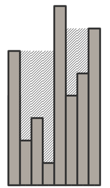

## 문제

남남서는 어젯밤 큰 홍수가 나는 꿈을 꿨다. 꿈 속에서, 물이 남남서의 키보다 높이 차올랐고, 남남서는 자신이 들고 있던 소중한 히스토그램을 놓쳐버렸다. 히스토그램을 간신히 다시 붙잡은 남남서는 자신의 히스토그램을 살펴보았다. 히스토그램이 젖어서 슬펐던 남남서는 슬프게 울다가 꿈에서 깼다.

히스토그램의 용량은 히스토그램에 물을 넘치지 않게 담았을 때 최대한 담을 수 있는 물의 양이다. 히스토그램의 각각의 열의 너비는 1이며, 높이는 h1, h2, …, hN이다. 오른쪽의 이미지는 물이 넘치지 않는 상태의 히스토그램의 예시이다.

조금 더 엄밀하게, 각각의 열의 위에 차올라있는 물의 높이를 v1, v2, …, vN 이라고 하자.

다음 조건들을 만족할 경우 물이 넘치지 않는다고 하자:

* v1 = 0, vN = 0
* vi > 0인 모든 2 이상의 i에 대해 hi + vi ≤ hi-1 + vi-1
* vi > 0인 모든 1 ≤ i ≤ (N-1)인 i에 대해 hi + vi ≤ hi+1 + vi+1

꿈에서 깬 남남서는 아직 몽롱한 채로 꿈에 대해 떠올렸다. 남남서는 히스토그램의 열을 {1, 2, …, N}의 순열(permutation)로 구성해서, 히스토그램의 용량이 남남서가 좋아하는 숫자 X와 정확히 같게 만들 수 있을지 궁금해졌다. 두껍고 푹신한 이불 속에서 더 자려고 하고 있는 남남서가 일어날 수 있도록 이러한 히스토그램을 만들어주자.

## 입력

첫 줄에 자연수 N과 X가 주어진다. (1 ≤ N ≤ 1 000 000, 1 ≤ X ≤ 1015)

## 출력

용량이 정확히 X인 히스토그램을 만들 수 없다면 첫째 줄에 -1을 출력해라. 그렇지 않다면 용량이 X가 되는 히스토그램의 열 h1, h2, …, hN를 출력해라. 그러한 방법이 여러 개가 있다면 아무 것이나 출력해도 된다.

## 힌트

첫 번째 예시에서, v1 = 0, v2 = 1, v3 = 0이다.

두 번째 예시에서, v1 = 0, v2 = 0, v3 = 1, v4 = 0이다.

세 번째 예시는 위의 그림과 같다. 빗금친 부분은 물이 찬 부분이다.
