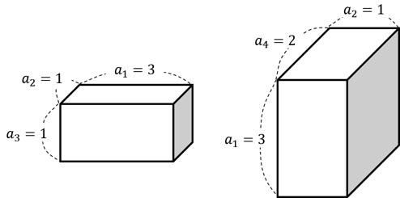

## 문제

승현이는 우리에게 지우개를 훼손당할 수 있다는 생각에, 직접 지우개를 만들어 보기로 했습니다.

승현이는 자신이 좋아하는 자연수들로 구성된 수열 a1, a2, ⋯, an을 생각해 냅니다. 그리고, 이 수열에서 서로 다른 세 원소 ai, aj, ak를 선택한 뒤, 이들을 가로, 세로, 높이로 하는 직육면체 모양의 지우개를 만들고 이를 i−j−k 지우개라고 명명하기로 했습니다. 단 승현이는 위로 길쭉한 지우개를 좋아하므로, ai < aj < ak를 만족해야 합니다.

위 그림을 한 번 살펴봅시다. 승현이가 만든 수열을 a1=3, a2=1, a3=1, a4=2라고 둡시다. 1−2−3 지우개는 만들 수 없는데, 3<1<1은 성립하지 않기 때문입니다. 반면 2−4−1 지우개는 1 < 2 < 3이 성립하므로 만들 수 있습니다. 이 수열에서 만들 수 있는 지우개는 2−4−1 지우개와 3−4−1 지우개뿐입니다.

이때 승현이는 만들 수 있는 모든 지우개들의 부피의 합을 갑자기 알고 싶어집니다. (지우개의 부피는 가로 길이, 세로 길이와 높이의 곱입니다.) 아마 창고에 지우개를 쌓아 놓아야 하니 그렇겠죠? 승현이가 지우개를 보관할 창고를 설계할 수 있도록 우리가 도와줍시다.

## 입력

첫 번째 줄에 수열의 크기 n이 주어집니다. (1 ≤ n ≤ 100,000)

두 번째 줄에 a1, a2, ⋯, an이 공백을 사이로 두고 차례대로 주어집니다. (1 ≤ ai ≤ 100,000)

## 출력

첫 번째 줄에 만들 수 있는 지우개들의 부피의 합을 출력합니다. 승현이는 프로그램이 제대로 동작하는 것부터 검증하기를 원하므로, 1,000,000,007 (109+7)로 나눈 나머지를 출력합시다.

## 힌트

위에 설명한 예제와 같습니다. 만들 수 있는 지우개는 2−4−1 지우개와 3−4−1 지우개뿐이므로, 부피의 합은 a2a4a1+a3a4a1=1×2×3+1×2×3=12가 됩니다.
