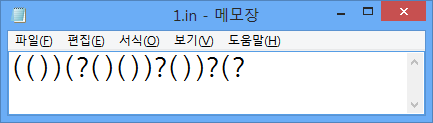

## 문제

괄호열이란 2개의 기호 '`(`'와 '`)`'를 이용해서 만들 수 있는 모든 문자열을 말합니다. 괄호열에 "`+`"과 "`1`"을 적당히 끼워넣으면 올바른 수식이 만들어질 때, 우리는 이를 올바른 괄호열이라고 합니다. 예로 들어, "`(()(()))`", "`()(()(())())`"은 올바른 괄호열이고, "`)(`", "`(()))()`"은 올바른 괄호열이 아닙니다.

저는 여러분에게 괄호열을 활용한 아주 쉬운 문제를 내고, 입력 데이터를 만들었습니다. 각 입력 데이터에는 올바른 괄호열이 들어가 있습니다. 그런데 이 채점 데이터를 열어보니, 괄호열의 일부가 아래와 같이 `?`로 바뀌어 있었습니다! 불행 중 다행으로, 각 '`?`'는 무조건 1개의 `(` 또는 `)` 기호가 깨진 것임을 알 수 있었습니다.

저는 모든 입력 데이터를 복구하고자 합니다. 그러나 단순하게 복구하면 데이터가 제가 의도했던 것보다 훨씬 쉬워질 것 같으니, 저는 왼쪽에서 i번째에 위치한 '`?`'마다 '`(`'로 바꾸는데 드는 비용 li와 '`)`'로 바꾸는데 드는 비용 ri를 계산해 놓았습니다.

여러분은 비용이 가장 적게 들도록 각 물음표를 `(` 또는 `)`로 적당히 치환하여 올바른 괄호열을 만들어 내는 프로그램을 작성해야 합니다. 괄호열을 복구하는 데 드는 총 비용은 각 물음표를 '`(`'나 '`)`'로 바꾸는 데 드는 비용의 합입니다. 이러한 경우가 여러 개 있으면 아무거나 만들면 됩니다. 제가 좋은 데이터를 만들 수 있도록 도와주세요! ㅠㅠ

## 입력

첫 번째 줄에 손상된 괄호열의 길이 N (N은 짝수, 2 ≤ N ≤ 100,000)이 주어지고, 두 번째 줄에 '`(`', '`)`', '`?`'로만 구성된 손상된 괄호열이 주어집니다. 손상된 괄호열에서 `?`의 빈도수를 Q (1 ≤ Q ≤ N)라고 할 때, Q개 줄에 두 자연수 li와 ri (1 ≤ li, ri ≤ 105)가 공백을 사이로 두고 주어집니다. (1 ≤ i ≤ Q)

## 출력

첫 번째 줄에 최소 비용을 출력하고, 두 번째 줄에 복구한 괄호열을 출력합니다. 최소 비용으로 만들 수 있는 괄호열이 여러 개 있으면 아무거나 출력하면 됩니다.
