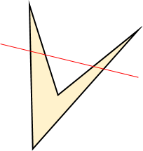

## 문제

승현이는 웹툰을 보는 것보다 더 생산적인 활동을 하고자 합니다. 그래서 종이에다가 아래와 같은 그림을 하나 그렸습니다.

남들과 보는 눈이 다른 승현이는 밑의 사각형 부분은 직선을 하나 그어서 모든 변을 자를 수 있다는 것을 알게 되었습니다.

이제 무슨 이야기가 나올 지 다 아시겠지만.. 승현이는 갑자기(?) 이러한 조건을 만족하는 다각형들의 종류가 몇 가지나 될지 궁금해졌습니다.

직선을 하나 그어서 모든 변을 자를 수 있는 n각형이 존재하는 모든 n들의 합을 구하는 프로그램을 작성하세요. 단 이러한 다각형은 무한히 존재할 것 같으니, n은 a 이상 b 이하여야 합니다.

## 입력

첫 번째 줄에 두 자연수 a와 b가 공백을 사이로 두고 주어집니다. (1 ≤ a ≤ b ≤ 109)

## 출력

첫 번째 줄에 위에서 요구한 답을 출력합니다.
