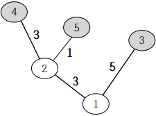

## 문제

어느 산의 강가에서 캠핑을 하는 수빈이와 진영이는 M채의 오두막집을 발견했습니다. 이 강에는 N개의 지역이 있는데, 1번 지역은 강의 하류에 위치해있고, 나머지 지역은 강의 중류 또는 상류에 위치해 있습니다. M채의 오두막집은 아래 그림과 같이(회색으로 색칠한 곳이 오두막집이 있는 지역) 각각 N개의 지역 중 한 곳에 있습니다.

한 지역(1번 지역 제외)에서 강을 따라 내려가면 다른 지역이 나오는데, 이 지역의 번호는 기존 지역의 번호보다 항상 작습니다.

한편, 이 강은 물살이 별로 세지 않기 때문에 강을 따라 내려가는 시간과 강을 거슬러 올라가는 시간은 서로 같습니다.

오두막집은 협소하기 때문에 수빈이와 진영이가 같은 오두막집에 있을 수 없습니다. 따라서 이 둘은 서로 다른 오두막집에 자리 잡아야 합니다.

수빈이와 진영이는 절친한 사이이기 때문에 가장 가까운 두 오두막집에 자리를 잡았습니다. 하지만 싸움이 나서 사 이가 안 좋아지면 K번째로 가까운 두 오두막집으로 자리를 옮겨야 합니다.

수빈이는 만일의 경우에 대비해서 싸움이 난 경우에 어디 있는 오두막집에 자리를 잡아야 할지 구해야 합니다. 수빈이를 도와 K번째로 가까운 두 오두막집의 거리를 구해주세요.

## 입력

첫 번째 줄에는 지역의 수 N, 오두막집의 수 M, 수빈이와 진영이의 관계 값 K가 주어집니다.

두 번째 줄에서부터 N−1개의 줄에는 2~N번 지역에서 강을 따라 내려가면 나오는 지역의 번호 Ri와 그때의 소요시간 Di가 주어집니다. (2≤i≤N)

N+1번째 줄에는 각 오두막집의 위치 Ci가 오름차순으로 주어집니다. 모든 오두막집은 서로 다른 곳에 있습니다.

2≤M≤N≤100,000

## 출력

K번째로 가까운 두 오두막집의 거리를 출력합니다.

## 힌트

만약 거리가 2인 오두막집의 쌍이 3쌍 있고 거리가 5인 오두막집의 쌍이 2쌍 있다면 K=1,2,3,4,5일 때의 답은 각각 2, 2, 2, 5, 5입니다.
