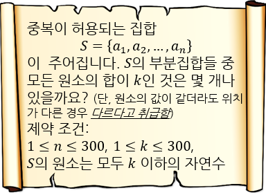

## 문제

문제를 출제하는 과정 중에서 중요한 축 중 하나가 바로 데이터를 만드는 일입니다. 데이터를 만드는 일반적인 방법 같은 것은 없고, 문제에 따라 발생할 수 있는 모든 오답들을 최대한 생각해보고 이들에 대비한 데이터를 만들어야 합니다.

예를 들어 아래와 같은 유명한 문제를 생각해 봅시다.

저는 이 문제에서 발생할 수 있는 다양한 오답들을 떠올리다가, 답이 정확히 t인 데이터에서 t - 1을 출력하는 답안을 생각해냈습니다. 이러한 답안을 걸러주는 데이터를 마련하기 위해, 저는 어떤 자연수 t가 주어졌을 때, 위 문제의 답이 t가 되도록 하는 집합 S와 자연수 k를 구해주는 프로그램이 필요합니다.

하지만 저는 그 능력이 부족한 관계로, 여러분이 대신 프로그램을 작성해주셔야 합니다.

## 입력

첫 번째 줄에 자연수 t가 주어집니다. (1 ≤ t ≤ 1018)

## 출력

첫 번째 줄에 n과 k를 공백을 사이로 두고 출력합니다. 두 번째 줄에 a1, a2, ..., an을 공백을 사이로 두고 출력합니다.

모든 변수의 이름과 제약 조건은 위 그림에 나타낸 문제와 같습니다. 출력한 데이터는 반드시 이 조건을 충족해야 합니다.
