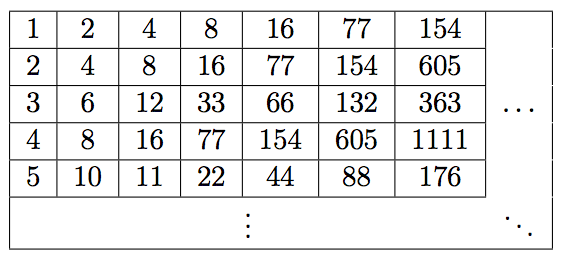

## 문제

Anica is having peculiar dream. She is dreaming about an infinite board. On that board, an infite table consisting of infinite rows and infinite columns containing infinite numbers is drawn. Interestingly, each number in the table appears a finite number of times.

The table is of exceptionally regular shape and its values meet the requirements of a simple recursive relation. The first cell of each row contains the ordinal number of that row. A value of a cell that is not in the first column can be calculated by adding up the number in the cell to the left of it and that same number, only written in reverse (in decimal representation).

Formally, if A(i, j) denotes the value in the ith row and the jth column, it holds:

* A(i, 1) = i
* A(i, j) = A(i, j − 1) + rev(A(i, j − 1)), for each j > 1

The first few rows and columns of the table. Notice that the table is infinite only in 2 directions.

Anica hasn’t shown too much interest in the board and obliviously passed by it. Behind the board, she noticed a lamp that immediately caught her attention. Anica also caught the lamp’s attention, so the friendly ghost Božo came out of it.

“Anica! If you answer correctly to my Q queries, you will win a package of Dorina wafer or Domaćica cookies, based on your own choice! I wouldn’t want to impose my stance, but in my personal opinion, the Dorina wafer cookies are better. Each query will consist of two integers A and B. You must answer how many appearances of numbers from the interval [A, B] there are on the board.”

Unfortunately, Anica couldn’t give an answer to the queries and woke up.

“Ah, I didn’t win the Dorina cookies, but at least I have a task for COCI”, she thought and went along with her business.

## 입력

The first line of input contains the integer Q (1 ≤ Q ≤ 105), the number of queries.

Each of the following Q lines contains two integers A and B (1 ≤ A ≤ B ≤ 1010) that represent the interval from the query.

## 출력

The ith line of output must contain a single integer – the answer to the ith query

## 힌트

rev(x) denotes the number x written in reverse in decimal representation. For example, rev(213) = 312, rev(406800) = 008604 = 8604.
