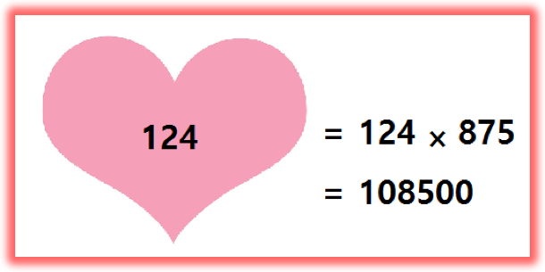

## 문제

하나의 양의 정수 n에 대해서 n의 ‘반전’인 F(n)은 다음과 같이 정의됩니다.

F(n) : n의 각 자리 수 a에 대해서 그 수를 (9 – a)로 바꾼 것

이때, 가장 큰 자리수의 유효숫자보다 앞에 등장하는 0들은 무시하는 것에 주의합니다. 따라서 9의 반전은 0이고, 91의 반전은 8, 124의 반전은 875, 990의 반전은 9가 됩니다.

여기서 어떤 수 n의 ‘사랑스러움’는 n과 n의 반전을 곱한 것으로 정의합니다. 입력으로 자연수 N이 주어지면, 1 이상 N 이하인 수들의 ‘사랑스러움’ 중 최댓값을 출력하세요.

## 입력

첫째 줄에는 테스트 케이스의 개수를 나타내는 하나의 자연수 T가 주어집니다. 다음 T개의 각 줄에는 하나의 양의 정수 N이 주어집니다. (1 ≤ N ≤ 1,000,000,000)

## 출력

각 테스트 케이스에 해당하는 1 이상 N 이하인 수들의 ‘사랑스러움’ 중 최댓값을 하나의 줄에 하나씩 출력하세요. 즉, k번째 테스트 케이스에 해당하는 답은 k번째 줄에 출력하시면 됩니다.

## 힌트

4 또는 5의 사랑스러움은 20이고 100의 사랑스러움은 89900입니다.
