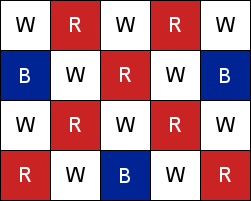
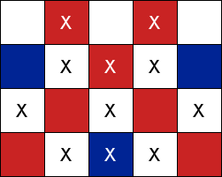
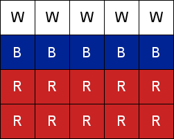
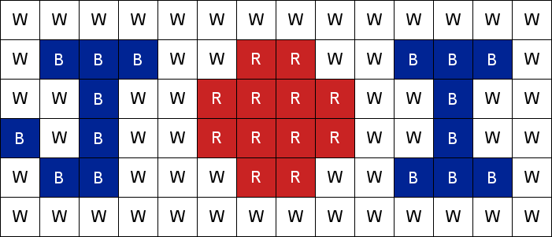

## 문제

2016년 국제정보올림피아드는 러시아에서 열린다.

러시아 국기는 3개의 색으로 구성되어 있다. 가장 윗 줄이 흰색, 다음 줄이 파란색, 마지막 줄이 빨간색으로 되어 있다.

JKJeong선생님께서 N\*M 격자판을 들고 왔다. 이 격자판은 각 칸이 흰색, 파란색, 빨간색 중 하나의 색으로 칠해져 있다. 선생님께서는 이 격자판을 이용하여 러시아 국기를 만들라는 과제를 주셨다.

만드는 규칙은 다음과 같다.

1. 각 칸의 색을 임의의 색으로 바꿀 수 있다.
2. 전체 색을 바꿨을 때, 가장 윗 부분은 흰색, 가운데 부분은 파란색, 아랫부분은 빨간색이어야 한다. 즉, 적어도 한 줄 이상은 흰색, 파란색, 빨간색이 있어야 한다.
3. 위 조건을 만족하도록 격자판에 색칠을 하되 최소의 색을 칠할 수 있도록 해야 한다.

위 규칙을 만족시키면서 러시아 국기형태로 만드는데 드는 최소 색칠 수를 구하는 프로그램을 작성하시오.

## 입력

첫 번째 줄에 N, M이 공백으로 구분되어 입력된다. (3 ≦ N ≦ 50, 3 ≦ M ≦ 50)

다음 줄부터 N줄에 걸쳐서 M개씩의 문자열이 주어진다.

각 문자열은 대문자로 "W", "B", "R" 중 하나의 문자로 구성된다.

"W"는 흰색, "B"는 파란색, "R"은 빨간색을 의미한다.

## 출력

러시아 국기 형태로 만들기 위해 색을 바꿔야할 최소 개수를 출력한다.

## 힌트

1번 예제는 다음과 같은 방법으로 두 입력 예제에서 러시아 국기를 만들 수 있다.

2번 예제는 이렇게 생겼다.

