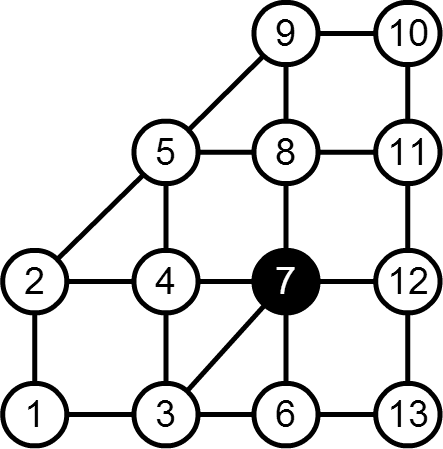

## 문제

JOI국은 N개의 도시와 M개의 도로로 이루어져 있다. 모든 도시는 도로로 연결되어 있으며, 각 도로를 통하지 않고는 다른 도시로 갈 수 없다.

이번에 K개의 도시는 좀비에 의해서 점령당했다. ㅠㅠ

따라서 경곽이는 벙커가 있는 가장 안전한 도시로 피난을 가기로 했다. 경곽이는 현재 1번 도시에 살고 있으며, 벙커가 있는 가장 안전한 피난처는 N번 도시이다. 1번 도시와 N번 도시는 아직 좀비에게 점령당하지 않았다.

경곽이는 각 도시를 이동할 때마다 1박을 해야하고, 1박을 할 때 숙박비를 지불해야 한다. 만약 그 도시가 좀비에게 점령당했다면 숙박이 불가능하다.

좀비에게 점령당한 도시로 부터 S번 이하의 이동으로 이동할 수 있는 모든 도시는 위험한 도시로 정의하며, 그 이외의 도시는 안전한 도시로 정의할 때, 만약 그 도시가 안전한 도시라면 숙박비가 p원이고, 만약 그 도시가 위험한 도시라면 숙박비는 q원이다. (좀비로부터 보호받기 위한 특별한 시큐리티 서비스를 제공하기 때문에 좀 더 비싸다 ㅠㅠ)

경곽이가 도시 1부터 N으로 이동하는 데 드는 최단 비용을 구하자.

## 입력

첫 번째 줄에 N, M, K, S가 공백으로 구분되어 입력된다. 각 값은 도시의 수, 길의 수, 좀비에게 점령당한 도시의 수, 위험한 도시의 범위 를 의미한다. (2 ≦ N ≦ 100000, 1 ≦ M ≦ 200000, 0 ≦ K ≦ N - 2, 0 ≦ S ≦ 100000)

다음 줄에는 숙박비를 나타내는 정수 p, q가 입력된다. (1 ≦ p ＜ q ≦ 100000)

그 다음 줄부터 K줄에 걸쳐서 좀비에게 점령당한 도시가 한 줄에 하나씩 주어진다.

다음 줄부터 M줄에 걸쳐서 각 도시를 연결하는 도로의 정보가 주어진다. 이 도로는 서로 양방향으로 이동 가능하다.

1번 도시에서 N번 도시로 항상 도달 가능하다.

## 출력

최소 비용을 출력한다.

## 힌트

도시는 이렇게 생겼다. 이때

1 - 2 - 5 - 9 - 10 - 11 - 12 - 13

으로 이동하는 것이 가장 싼 가격으로 이동할 수 있는 방법이다.

이때 1과 13에서는 숙박할 필요가 없다.
