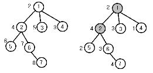

## 문제

n(1<=n<=1,000)개의 정점을 가지고 있는 트리 T가 있다. T는 루트가 있는 트리이며, 각각의 노드에는 가중치 w(1<=w<=50,000)가 있다. 이때, 각 노드의 가중치는 부모 노드의 가중치보다 크다고 한다. T의 각 노드는 특별 노드와 일반 노드로 분류된다. 만약 어떤 노드가 특별 노드라면, 그 노드의 가중치는 원래의 가중치가 된다. 만약 어떤 노드 v가 특별 노드가 아니라면, 그 노드의 가중치는 그 노드의 가장 가까운 특별 노드인 부모 노드 u에 대해서 v의 가중치 - u의 가중치가 된다. 이해를 돕기 위해 아래의 그림을 보자

왼쪽 그림은 원래의 트리이다. 원 안의 숫자는 노드의 번호이며, 원 옆의 숫자는 그 노드의 가중치이다. 오른쪽 그림은 1번, 2번 노드를 특별 노드로 했을 때, 다시 가중치가 계산된 트리이다.

문제는, 원래의 트리 T가 주어졌을 때, 다시 계산된 가중치의 합의 최소가 되도록 하는 특별 노드들을 찾는 것이다. 위의 예에서는 왼쪽 트리의 가중치의 합이 35이고, 오른쪽 트리의 가중치의 합은 19이다. 루트는 항상 특별 노드라고 하자.

## 입력

첫째 줄에는 노드의 수 n과 루트의 번호가 주어진다. 둘째 줄에는 1, 2, 3, , n번 노드의 가중치가 공백으로 구분되어 주어진다. 다음 n-1개의 줄에는 각 줄에 두 개의 정수로 주어진 트리 상에서 연결되어 있는 두 정점의 번호가 주어진다.

## 출력

첫째 줄에 가중치의 합을 출력한다.
