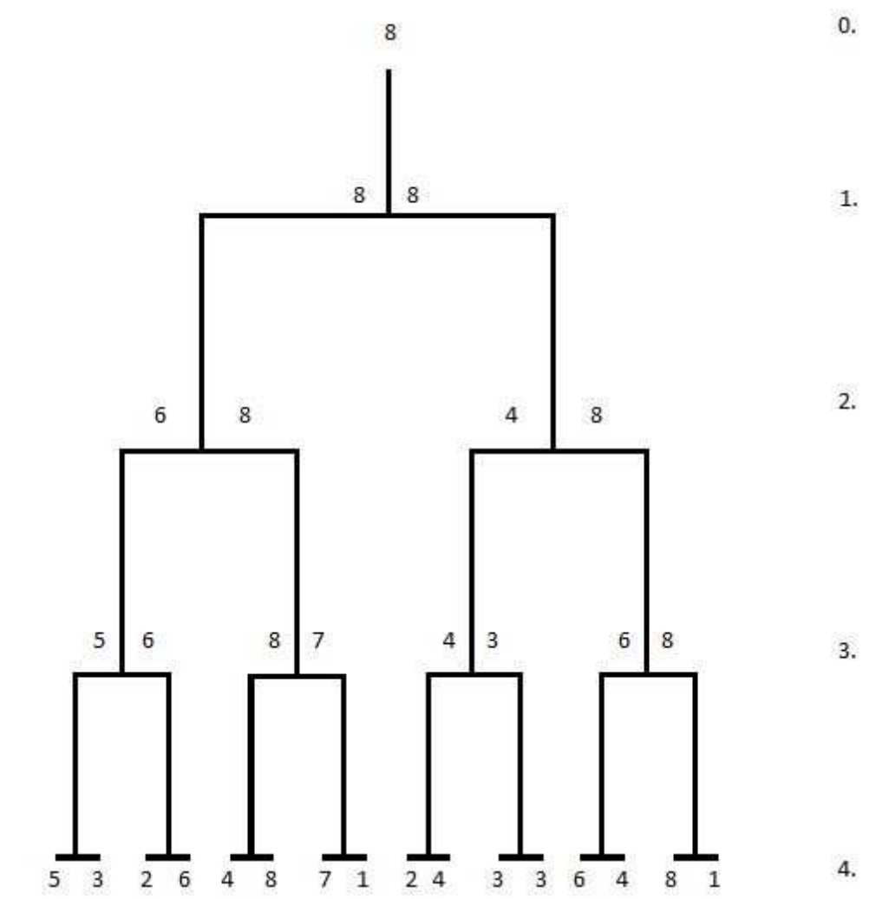

## 문제

Young Jozef was given a set consisting of 2N positive integers as a gift. Considering the fact that Jozef often takes part in football tournaments, he decided to organize a tournament for his 2N positive integers.

The numbers tournament is depicted below; the tournament takes place in pairs, where the higher of two numbers advances to the upper level. The levels are denoted with numbers from 1 to N, where the highest level is given the number 0.

Since Jozef doesn’t have time to organize all tournaments, he wants to know, for each number from the initial set, the highest level (the smallest level number) at which the number can end up in, for any permutation of the input array.

## 입력

The first line of input contains the positive integer N (1 ≤ N ≤ 20).

The following line contains 2N positive integers from the interval [1, 109], the elements of the set.

## 출력

The first and only line of output must contain 2N numbers, the labels of the highest level (the smallest level labels) at which a number can end up in, in the order the numbers were given in the input.
