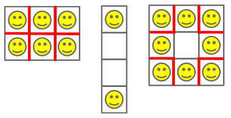

## 문제

You are a landlord who owns a building that is an **R** x **C** grid of apartments; each apartment is a unit square cell with four walls. You want to rent out **N** of these apartments to tenants, with exactly one tenant per apartment, and leave the others empty. Unfortunately, all of your potential tenants are noisy, so whenever any two occupied apartments share a wall (and not just a corner), this will add one point of *unhappiness* to the building. For example, a 2x2 building in which every apartment is occupied has four walls that are shared by neighboring tenants, and so the building's unhappiness score is 4.  
  
If you place your **N** tenants optimally, what is the minimum unhappiness value for your building?

## 입력

The first line of the input gives the number of test cases, **T**. **T** lines follow; each contains three space-separated integers: **R**, **C**, and **N**.

### Limits

* 1 ≤ **T** ≤ 1000.
* 0 ≤ **N** ≤ **R\*C**.
* 1 ≤ **R\*C** ≤ 16.

## 출력

For each test case, output one line containing "Case #x: y", where x is the test case number (starting from 1) and y is the minimum possible unhappiness for the building.

## 힌트

In Case #1, every room is occupied by a tenant and all seven internal walls have tenants on either side.  
  
In Case #2, there are various ways to place the two tenants so that they do not share a wall. One is illustrated below.  
  
In Case #3, the optimal strategy is to place the eight tenants in a ring, leaving the middle apartment unoccupied.  
  
Here are illustrations of sample cases 1-3. Each red wall adds a point of unhappiness.  
  

