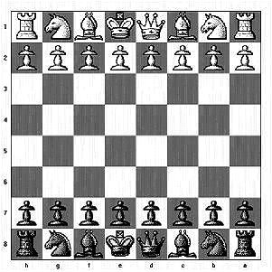

## 문제

Given an arranged chess board with pieces, figure out the total number of different ways in which any piece can be killed **in one move**. Note: in this problem, the pieces can be killed despite of the color.

For example, if there are 3 pieces King is at B2, Pawn at A1 and Queen at H8 then the total number of pieces that an be killed is 3. H8-Q can kill B2-K, A1-P can kill B2-K, B2-K can kill A1-P

A position on the chess board is represented as A1, A2... A8,B1.. H8

Pieces are represented as

* (K) King can move in 8 direction by one place.
* (Q) Queen can move in 8 direction by any number of places, but can't overtake another piece.
* (R) Rook can only move vertically or horitonzally, but can't overtake another piece.
* (B) Bishop can only move diagonally, but can't overtake another piece.
* (N) Knights can move to a square that is two squares horizontally and one square vertically **OR** one squares horizontally and two square vertically.
* (P) Pawn can only kill by moving diagonally upwards (towards higher number i.e. A -> B, B->C and so on).

## 입력

The first line of the input gives the number of test cases, **T**. **T** Test cases follow. Each test case consists of the number of pieces , **N**. **N** lines follow, each line mentions where a piece is present followed by **-** with the piece type

Limits

* 1 ≤ **T** ≤ 100.
* 1 ≤ **N** ≤ 64.

## 출력

For each test case, output one line containing "Case #x: y", where x is the test case number (starting from 1) and y is the the total number of different ways in which any piece can be killed.
