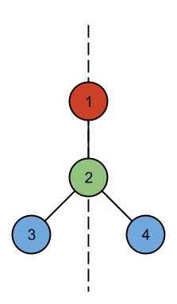
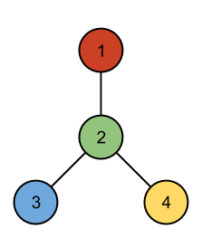
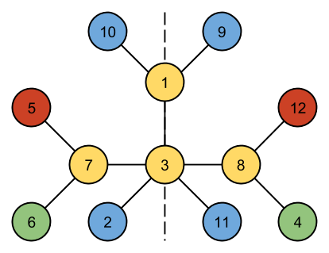

## 문제

Given a vertex-colored tree with N nodes, can it be drawn in a 2D plane with a line of symmetry?

Formally, a tree is *line-symmetric* if each vertex can be assigned a location in the 2D plane such that:

* All locations are distinct.
* If vertex **v****i** has color **C** and coordinates (**x****i**, **y****i**), there must also be a vertex **v****i****'** of color **C** located at (-**x****i**, **y****i**) -- Note if **x****i** is 0, **v****i** and **v****i****'** are the same vertex.
* For each edge (**v****i**, **v****j**), there must also exist an edge (**v****i****'**, **v****j****'**).
* If edges were represented by straight lines between their end vertices, no two edges would share any points except where adjacent edges touch at their endpoints.

## 입력

The first line of the input gives the number of test cases, **T**. **T** test cases follow.

Each test case starts with a line containing a single integer **N**, the number of vertices in the tree.

**N** lines then follow, each containing a single uppercase letter. The i-th line represents the color of the i-th node.

**N**-1 lines then follow, each line containing two integers **i** and **j** (1 ≤ **i** < **j** ≤ **N**). This denotes that the tree has an edge from the **i**-th vertex to the **j**-th vertex. The edges will describe a connected tree.

Limits

* 1 ≤ **T** ≤ 100.
* 2 ≤ **N** ≤ 12.

## 출력

For each test case, output one line containing "Case #x: y", where x is the case number (starting from 1) and y is "SYMMETRIC" if the tree is line-symmetric by the definition above or "NOT SYMMETRIC" if it isn't.

## 힌트

The first case can be drawn as follows:

No arrangement of the second case has a line of symmetry:

One way of drawing the third case with a symmetry line is as follows:

