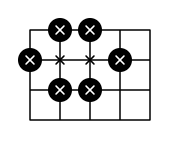

## 문제

Your task in this problem is to find out the minimum number of stones needed to place on an N-by-M rectangular grid (N horizontal line segments and M vertical line segments) to enclose at least K intersection points. An intersection point is enclosed if either of the following conditions is true:

1. A stone is placed at the point.
2. Starting from the point, we cannot trace a path along grid lines to reach an empty point on the grid border through empty intersection points only.

For example, to enclose 8 points on a 4x5 grid, we need at least 6 stones. One of many valid stone layouts is shown below. Enclosed points are marked with an "x".

## 입력

The first line of the input gives the number of test cases, **T**. **T** lines follow. Each test case is a line of three integers: **N** **M** **K**.

Limits

* 1 ≤ **T** ≤ 100.
* 1 ≤ **N**.
* 1 ≤ **M**.
* 1 ≤ **K** ≤ **N** × **M**.
* **N** × **M** ≤ 20.

## 출력

For each test case, output one line containing "Case #x: y", where x is the test case number (starting from 1) and y is the minimum number of stones needed.
