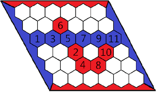

## 문제

This problem was inspired by a board game called Hex, designed independently by Piet Hein and John Nash. It has a similar idea, but does not assume you have played Hex.

This game is played on an **N**x**N** board, where each cell is a hexagon. There are two players: Red side (using red stones) and Blue side (using blue stones). The board starts empty, and the two players take turns placing a stone of their color on a single cell within the overall playing board. Each player can place their stone on any cell not occupied by another stone of any color. There is no requirement that a stone must be placed beside another stone of the same color. The player to start first is determined randomly (with equal probability among the two players).

The upper side and lower sides of the board are marked as red, and the other two sides are marked as blue. The goal of the game is to form a connected path of one player's stones connecting the two sides of the board that have that player's color. The first player to achieve this wins. Note that the four corners are considered connected to both colors.

The game ends immediately when one player wins.

Given a game state, help someone new to the game determine the status of a game board. Say one of the following:

* "**Impossible**": If it was impossible for two players to follow the rules and to have arrived at that game state.
* "**Red wins**": If the player playing the red stones has won.
* "**Blue wins**": If the player playing the blue stones has won.
* "**Nobody wins**": If nobody has yet won the game. Note that a game of Hex can't end without a winner!

Note that in any impossible state, the only correct answer is "Impossible", even if red or blue has formed a connected path of stones linking the opposing sides of the board marked by his or her colors.

Here's a an example game on a 6x6 gameboard where blue won. Blue was the first player to move, and placed a blue stone at cell marked as 1. Then Red placed at cell 2, then blue at cell 3, etc. After the 11th stone is placed, blue wins.

## 입력

The first line of input gives the number of test cases, **T**. **T** test cases follow. Each test case start with the size of the side of the board, **N**. This is followed by a board of **N** rows and **N** columns consisting of only 'B', 'R' and '.' characters. 'B' indicates a cell occupied by blue stone, 'R' indicates a cell occupied by red stone, and '.' indicates an empty cell.

Limits

* 1 ≤ **T** ≤ 100.
* 1 ≤ **N** ≤ 100.

## 출력

For each test case, output one line containing "Case #x: y", where x is the case number (starting from 1) and y is the status of the game board. It can be "Impossible", "Blue wins", "Red wins" or "Nobody wins" (excluding the quotes). Note that the judge is case-sensitive, so answers of "impossible", "blue wins", "red wins" and "nobody wins" will be judged incorrect.
