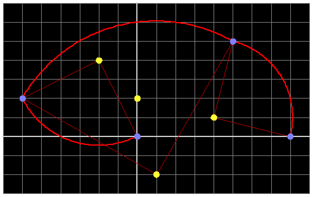

## 문제

> "I say we must move forward, not backward;  
> upward, not forward;  
> and always twirling, twirling, twirling towards freedom!"  
> — *Former U.S. Presidential nominee Kodos.*

After hearing this inspirational quote from America's first presidential nominee from the planet Rigel VII, you have decided that you too would like to twirl (rotate) towards freedom. For the purposes of this problem, you can think of "freedom" as being as far away from your starting location as possible.

The galaxy is a two-dimensional plane. Your space ship starts at the origin, position (0, 0). There are **N** stars in the galaxy. Every minute, you can choose a star and rotate your space ship 90 degrees clockwise around the star. You may also choose to stay where you are.

How far away can you move from the origin after **M** minutes?

The image illustrates the first 3 rotations for a possible path in sample case 1. Note that this path is not necessarily a part of any optimal solution.

## 입력

The first line of the input gives the number of test cases, **T**. **T** test cases follow, beginning with two lines containing integers **N** and **M**. The next **N** lines each contain two integers, **X**iand **Y**i, representing the locations of stars.

### Limits

* 1 ≤ **T** ≤ 100;
* -1000 ≤ **Xi** ≤ 1000;
* -1000 ≤ **Yi** ≤ 1000.
* No two stars will be at the same location.
* There may be a star at the origin.
* 1 ≤ **N** ≤ 10.
* 1 ≤ **M** ≤ 10.

## 출력

For each test case, output one line containing "Case #x: **D**", where x is the case number (starting from 1) and **D** is the distance from the origin to the optimal final position. Answers with absolute or relative error no larger than 10-6 will be accepted.
