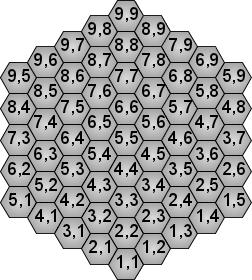
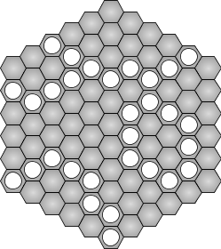

## 문제

Havannah is an abstract strategy board game created by Christian Freeling. Havannah is a game played on a hexagonal board with **S** hexagons to each side. Each hexagon has two horizontal and four slanted edges. The hexagons are identified by pairs of integer values. The hexagon in the bottom corner of the board is (1, 1). The hexagon adjacent to (x, y) in the direction of a two-o'clock hand is (x, y+1). The hexagon adjacent to (x, y) in the direction of a ten-o'clock hand is (x + 1, y). Here is an example board with **S** = 5:

In the game of Havannah, each hexagon can be occupied by at most one stone. Stones once put on the board are never removed or moved. The goal of the game is to build from stones a *connected* set of stones of one of three kinds. The winning structures are:

* A **ring** that encircles one or more *empty* hexagons. That is, at least one of the inner hexagons must be empty. More specifically, there is an empty hexagon that is separated from the outermost boundary of the board by hexagons with stones.*Note that this rule is different from the official game Havannah.*
* A **bridge** that connects any two corners of the board.
* A **fork** that connects any three of the board's six edges. Corners do not count as part of either adjacent edge.

This picture shows examples of winning structures:

Your program should determine whether a sequence of moves of **a single player** builds a winning structure. If so, it should output the name of the structure and the number of the move that completed it. If a move completes multiple rings, connects more than two corners, or connects more than three edges, the structure is still considered a ring, a bridge, or a fork, respectively. But if a move completes structures of different kinds at once, your program should output the names of all of them. We are only interested in the first winning move: ignore all moves following the winning one. If there is no winning structure on the board after playing all the moves from the sequence, your program should output `none`.

## 입력

The first line of input gives the number of test cases, **T**. **T** test cases follow. The first line of each test case contains two integers **S** and **M**, the number of hexagons on each side of the board and the number of moves in the sequence, respectively. The next **M** lines provide the sequence of moves, in order, where each line contains a space-separated pair (x, y) of hexagon identifiers. All the moves in the sequence lie on the board of size **S**. In each test case, the board is initially empty and the moves do not repeat.

### Limits

* 1 ≤ **T** ≤ 200
* 2 ≤ **S** ≤ 50
* 0 ≤ **M** ≤ 100

## 출력

For each test case, output one line containing "Case #**n**: " followed by one of:

* `none`
* `bridge in move`*k*
* `fork in move`*k*
* `ring in move`*k*
* `bridge-fork in move`*k*
* `bridge-ring in move`*k*
* `fork-ring in move`*k*
* `bridge-fork-ring in move`*k*

The cases are numbered starting from 1. The moves are numbered starting from 1.

## 힌트

Havannah was created by Christian Freeling and MindSports. MindSports and Christian Freeling do not endorse and have no involvement with Google Code Jam.
