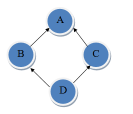

## 문제

You are asked to help diagnose class diagrams to identify instances of diamond inheritance. The following example class diagram illustrates the property of diamond inheritance. There are four classes: A, B, C and D. An arrow pointing from X to Y indicates that class X inherits from class Y.

In this class diagram, D inherits from both B and C, B inherits from A, and C also inherits from A. An inheritance path from X to Y is defined as a sequence of classes X, C1, C2, C3, ..., Cn, Y where X inherits from C1, Ci inherits from Ci + 1 for 1 ≤ i ≤ n - 1, and Cn inherits from Y. There are two inheritance paths from D to A in the example above. The first path is D, B, A and the second path is D, C, A.

A class diagram is said to contain a diamond inheritance if there exists a pair of classes X and Y such that there are at least two different inheritance paths from X to Y. The above class diagram is a classic example of diamond inheritance. Your task is to determine whether or not a given class diagram contains a diamond inheritance.

## 입력

The first line of the input gives the number of test cases, **T**.  **T** test cases follow, each specifies a class diagram. The first line of each test case gives the number of classes in this diagram, **N**. The classes are numbered from 1 to **N**.  **N** lines follow. The ith line starts with a non-negative integer **Mi** indicating the number of classes that class *i* inherits from. This is followed by **Mi** distinct positive integers each from 1 to **N** representing those classes. You may assume that:

* If there is an inheritance path from X to Y then there is no inheritance path from Y to X.
* A class will never inherit from itself.

### Limits

* 1 ≤ **T** ≤ 50.
* 0 ≤ **Mi** ≤ 10.
* 1 ≤ **N** ≤ 50.

## 출력

For each diagram, output one line containing "Case #x: y", where x is the case number (starting from 1) and y is "Yes" if the class diagram contains a diamond inheritance, "No" otherwise.
